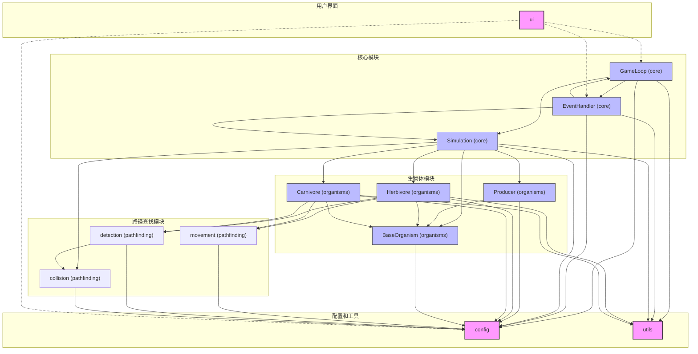
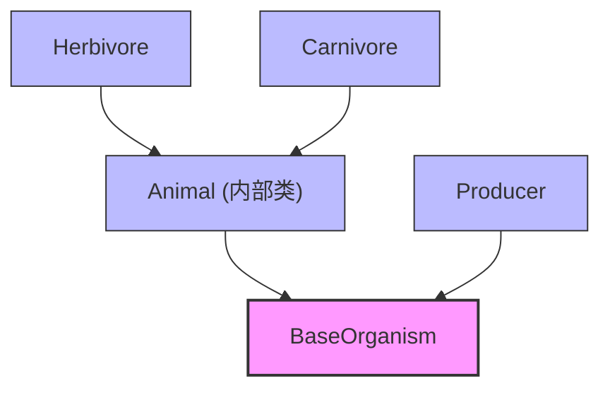

# 生态系统模拟项目模块依赖图

## 整体架构概述

这个生态系统模拟项目由多个模块组成，每个模块负责特定功能，形成完整的模拟系统。以下是各模块之间的依赖关系图。

## 模块依赖关系表

| 模块 | 主要组件 | 依赖模块 | 功能说明 |
|------|---------|----------|----------|
| **core** | GameLoop, EventHandler, Simulation | config, organisms, pathfinding, utils | 核心控制逻辑，包含游戏循环、事件处理和模拟引擎 |
| **organisms** | BaseOrganism, Producer, Herbivore, Carnivore | config, pathfinding, utils | 生物体实现，包含生产者、草食动物和肉食动物 |
| **pathfinding** | movement, detection, collision | config | 路径查找和碰撞检测，包含移动、感知和碰撞处理 |
| **config** | constants, settings | - | 配置管理，提供常量和设置功能 |
| **utils** | 工具函数 | - | 通用工具函数集合 |
| **ui** | 界面组件 | - | 用户界面组件（待分析） |

## 详细依赖关系图（Mermaid格式）

## 继承关系图

## 模块间调用关系说明

1. **core模块** 是系统的核心控制中心：
   - `GameLoop` 控制整个程序的运行循环
   - `EventHandler` 处理用户输入和UI事件
   - `Simulation` 管理所有生物体和生态系统逻辑

2. **organisms模块** 实现了生态系统中的各种生物：
   - `BaseOrganism` 提供所有生物共有的属性和方法
   - `Producer` 实现生产者（植物）的功能
   - `Herbivore` 实现草食动物的功能
   - `Carnivore` 实现肉食动物的功能

3. **pathfinding模块** 为生物体提供移动和感知功能：
   - `movement` 处理移动方向计算和新位置确定
   - `detection` 负责目标和危险的感知
   - `collision` 处理碰撞检测和捕食关系

4. **config模块** 为整个系统提供配置支持：
   - 提供常量定义
   - 管理系统设置

5. **utils模块** 提供通用工具函数：
   - 性能测量
   - 数学计算
   - 其他辅助功能

## 注意事项

- 此依赖图基于对代码的静态分析，可能不包含所有运行时依赖
- ui模块的依赖关系尚未完全分析，以虚线表示
- 某些内部依赖（如类之间的调用）未在图中完全显示

*最后更新时间：2023-XX-XX*