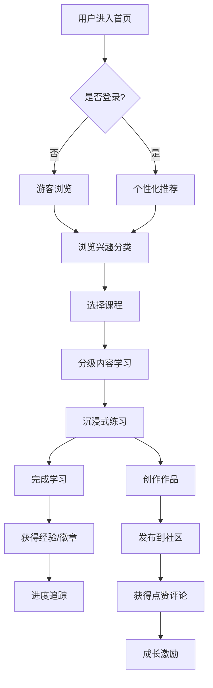

## 1. 产品概述

「趣享」是一款轻量化线上兴趣技能分享平台，涵盖手工、绘画、摄影、手作美食、数码剪辑等大众兴趣领域，主打零基础兴趣学习与技能分享，打造轻松的线上兴趣交流体验。

- **目标用户**：对各类兴趣爱好有学习热情的零基础人群，希望利用碎片时间轻松学习新技能
- **核心价值**：低门槛、轻量化、沉浸式的兴趣学习体验，结合社区互动与成就激励，让学习变得有趣

## 2. 核心功能

### 2.1 用户角色

| 角色 | 注册方式 | 核心权限 |
|------|----------|----------|
| 普通用户 | 用户名/密码注册 | 浏览内容、学习课程、发布作品、社区互动、查看进度 |

### 2.2 功能模块

1. **首页/发现页**：兴趣分类导航、个性化推荐、热门课程、精选作品
2. **课程学习页**：分级内容体系、沉浸式练习、步骤引导
3. **作品创作页**：创作工具、作品发布、草稿保存
4. **个人中心**：学习进度追踪、成就徽章、我的作品、个人信息
5. **社区广场**：作品展示、点赞评论、排行榜
6. **登录注册页**：简洁的用户认证体系

### 2.3 页面详情

| 页面名称 | 模块名称 | 功能描述 |
|----------|----------|----------|
| 首页 | 顶部导航 | Logo、搜索、分类入口、登录/个人中心入口 |
| 首页 | 兴趣分类区 | 手工、绘画、摄影、美食、剪辑五大分类卡片 |
| 首页 | 个性化推荐 | 基于用户兴趣的课程推荐 |
| 首页 | 热门作品 | 社区精选作品展示 |
| 课程详情页 | 课程信息 | 标题、难度等级、学习人数、时长 |
| 课程详情页 | 分级目录 | 初级/中级/高级章节列表 |
| 课程详情页 | 互动练习区 | 步骤引导、实时练习、进度保存 |
| 创作页 | 创作画布 | 简易绘画/编辑工具 |
| 创作页 | 作品发布 | 添加标题、描述、分类、发布 |
| 个人中心 | 学习进度 | 学习时长、完成课程数、当前学习课程 |
| 个人中心 | 成就徽章 | 已获得徽章、待解锁徽章 |
| 个人中心 | 我的作品 | 作品列表、编辑删除 |
| 社区广场 | 作品瀑布流 | 作品卡片、筛选排序 |
| 社区广场 | 互动区 | 点赞、评论、收藏 |
| 登录注册 | 登录表单 | 用户名/密码登录 |
| 登录注册 | 注册表单 | 新用户注册、兴趣选择 |

## 3. 核心流程

### 3.1 用户学习流程
用户进入首页 → 浏览兴趣分类 → 选择感兴趣的课程 → 查看分级内容 → 进入沉浸式练习 → 完成学习获得经验值 → 进度自动保存

### 3.2 作品创作与分享流程
用户进入创作页 → 使用创作工具制作作品 → 保存草稿/发布作品 → 作品展示在社区广场 → 获得点赞评论 → 解锁成就徽章

### 3.3 流程图

## 4. 用户界面设计

### 4.1 设计风格

- **主色调**：温暖的橙黄色系（#FF8C42），传递活力与创意
- **辅助色**：薄荷绿（#4ECDC4）、薰衣草紫（#9B89B3），用于不同兴趣分类区分
- **中性色**：米白背景（#FFF9F2）、深灰文字（#333333）
- **按钮风格**：圆角胶囊按钮，带微渐变和悬停动效
- **字体**：标题使用圆润可爱的字体，正文清晰易读
- **布局风格**：卡片式布局，柔和阴影，圆角设计
- **图标/emoji**：使用emoji增强趣味性，搭配简约线性图标

### 4.2 页面设计概览

| 页面名称 | 模块名称 | UI元素 |
|----------|----------|--------|
| 首页 | Hero区域 | 渐变背景、大标题、搜索框、分类快捷入口 |
| 首页 | 分类卡片 | 彩色渐变卡片、emoji图标、hover上浮效果 |
| 首页 | 推荐列表 | 横向滚动课程卡片、进度条、难度标签 |
| 课程详情 | 目录导航 | 可折叠章节列表、完成状态标记 |
| 课程详情 | 练习区 | 大画布区域、步骤指示器、工具栏 |
| 个人中心 | 进度面板 | 环形进度图、数据统计卡片 |
| 个人中心 | 徽章墙 | 网格布局、已获得/未解锁状态 |
| 社区广场 | 瀑布流 | 不等高卡片、 masonry布局 |

### 4.3 响应式设计

- 桌面端优先设计，适配平板和移动端
- 移动端采用单列布局，底部导航栏
- 触控区域优化，确保手指点击友好

### 4.4 动效设计

- 页面切换采用淡入淡出过渡
- 卡片悬停时有轻微上浮和阴影加深
- 进度条和数据展示有计数动画
- 成就解锁时有庆祝动效
