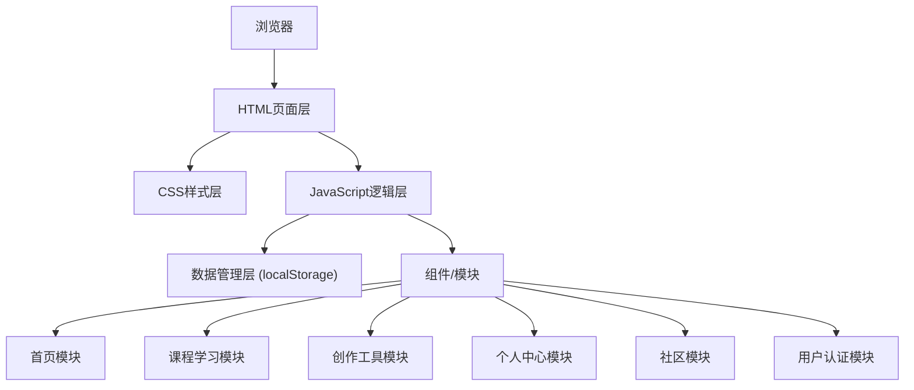

## 1. 架构设计



## 2. 技术说明

- **前端技术**：纯 HTML5 + CSS3 + 原生 JavaScript (ES6+)
- **构建工具**：无需构建工具，直接运行
- **数据存储**：浏览器 localStorage 本地存储
- **图标方案**：Emoji + CSS 绘制图标
- **字体方案**：Google Fonts 在线字体
- **动画方案**：CSS3 动画 + 少量 JS 动画

## 3. 页面结构

| 页面 | 文件名 | 说明 |
|------|--------|------|
| 首页 | index.html | 兴趣分类、推荐、热门作品 |
| 课程详情 | course.html | 分级内容、沉浸式练习 |
| 创作页 | create.html | 创作工具、作品发布 |
| 个人中心 | profile.html | 进度追踪、成就徽章、我的作品 |
| 社区广场 | community.html | 作品展示、互动 |
| 登录注册 | login.html | 用户认证 |

## 4. 目录结构

```
/
├── index.html              # 首页
├── course.html             # 课程详情页
├── create.html             # 创作页
├── profile.html            # 个人中心
├── community.html          # 社区广场
├── login.html              # 登录注册
├── css/
│   ├── style.css           # 全局样式
│   ├── components.css      # 组件样式
│   └── animations.css      # 动画样式
├── js/
│   ├── app.js              # 主应用逻辑
│   ├── data.js             # Mock数据
│   ├── auth.js             # 用户认证
│   ├── storage.js          # 本地存储管理
│   └── utils.js            # 工具函数
└── assets/
    └── images/             # 图片资源（使用在线图片）
```

## 5. 数据模型

### 5.1 用户数据
```javascript
{
  id: string,
  username: string,
  password: string, // 简单加密
  avatar: string,   // emoji头像
  interests: [],    // 兴趣标签
  level: number,    // 用户等级
  exp: number,      // 经验值
  totalLearnTime: number, // 总学习时长（分钟）
  completedCourses: [],   // 完成的课程
  badges: [],       // 获得的徽章
  works: [],        // 发布的作品
  createdAt: date
}
```

### 5.2 课程数据
```javascript
{
  id: string,
  title: string,
  category: string, // 手工/绘画/摄影/美食/剪辑
  difficulty: 'beginner' | 'intermediate' | 'advanced',
  duration: number, // 预计时长（分钟）
  description: string,
  cover: string,
  chapters: [
    {
      id: string,
      title: string,
      level: number, // 1初级 2中级 3高级
      content: string,
      steps: [],
      practice: {} // 练习配置
    }
  ],
  learners: number
}
```

### 5.3 作品数据
```javascript
{
  id: string,
  userId: string,
  username: string,
  title: string,
  description: string,
  category: string,
  image: string, // base64或颜色占位
  likes: number,
  comments: [],
  createdAt: date
}
```

### 5.4 学习进度数据
```javascript
{
  userId: string,
  courseId: string,
  currentChapter: number,
  completedChapters: [],
  progress: number, // 0-100
  lastLearnTime: date
}
```

## 6. 核心模块说明

### 6.1 存储模块 (storage.js)
- 封装 localStorage 操作
- 提供用户、课程、作品、进度的 CRUD 方法
- 数据初始化（首次访问注入 mock 数据）

### 6.2 用户认证模块 (auth.js)
- 注册/登录/登出
- 登录状态保持
- 当前用户信息获取

### 6.3 工具模块 (utils.js)
- 通用工具函数
- 格式化函数
- 动画辅助函数

### 6.4 主应用模块 (app.js)
- 页面初始化
- 导航控制
- 全局事件绑定
- 各页面功能入口

## 7. 性能与体验优化

- 使用 CSS 变量管理主题色，支持快速切换
- 页面切换使用平滑过渡动画
- 数据变更即时保存到 localStorage
- 响应式布局适配多设备
- 加载状态和骨架屏提升感知速度
