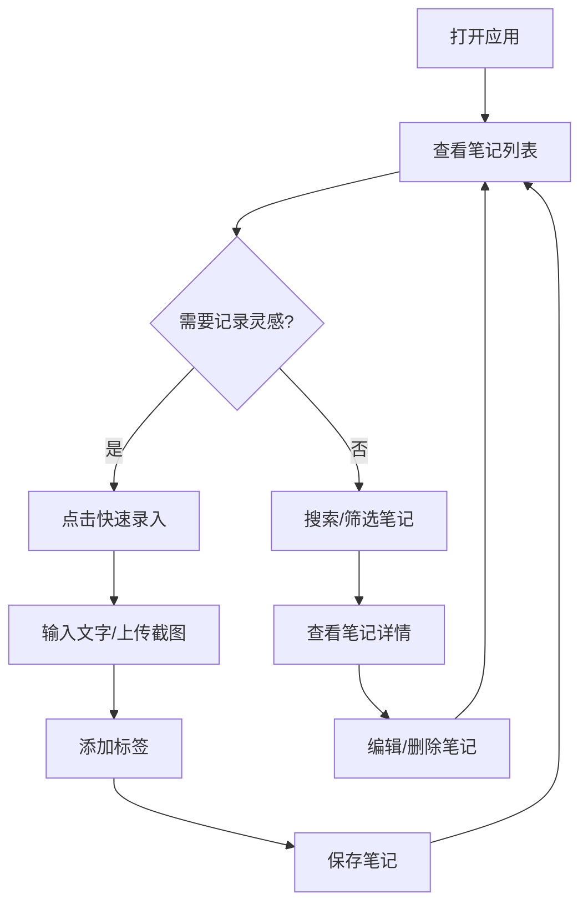

## 1. Product Overview

速记碎片本是一款轻量化的网页笔记应用，专为上班族和学生设计，解决临时灵感、知识点来不及记录的痛点。通过一键快速录入碎片化文字和截图，帮助用户充分利用零散时间积累知识。

## 2. Core Features

### 2.1 User Roles
| Role | Registration Method | Core Permissions |
|------|---------------------|------------------|
| Normal User | Local storage (无需注册) | 创建、编辑、删除笔记，分类管理 |

### 2.2 Feature Module
1. **首页/笔记列表**: 笔记卡片展示、搜索筛选、分类标签
2. **快速录入**: 一键新建笔记、快捷输入、截图上传
3. **笔记详情**: 编辑内容、添加标签、时间戳显示

### 2.3 Page Details
| Page Name | Module Name | Feature description |
|-----------|-------------|---------------------|
| 首页 | 顶部导航 | Logo、搜索框、新建按钮 |
| 首页 | 分类标签 | 按标签筛选笔记 |
| 首页 | 笔记列表 | 卡片式展示，显示摘要和时间 |
| 首页 | 快速录入 | 浮动按钮，点击弹出录入框 |
| 笔记详情 | 内容编辑 | 富文本编辑、标签管理 |

## 3. Core Process

用户打开应用 → 点击快速录入按钮 → 输入文字/上传截图 → 添加标签 → 保存笔记 → 在列表中查看所有笔记

## 4. User Interface Design

### 4.1 Design Style
- **主色调**: 清新绿色 (#22c55e)，象征生机与灵感
- **辅助色**: 暖灰色 (#f5f5f5) 背景
- **按钮风格**: 圆角扁平设计，hover效果微缩放
- **字体**: 中文使用"思源黑体"，英文使用"Inter"
- **布局**: 卡片式设计，左右留白，呼吸感强
- **图标**: 简洁线性图标

### 4.2 Page Design Overview
| Page Name | Module Name | UI Elements |
|-----------|-------------|-------------|
| 首页 | 顶部导航 | 居中Logo、右侧搜索框、新建按钮 |
| 首页 | 分类标签 | 横向滚动标签栏，选中状态高亮 |
| 首页 | 笔记列表 | 瀑布流卡片，显示首行内容、标签、时间 |
| 首页 | 快速录入 | 右下角浮动圆形按钮，带铅笔图标 |
| 笔记详情 | 模态框 | 全屏覆盖，背景模糊效果 |

### 4.3 Responsiveness
- **移动端优先**: 小屏显示单列卡片
- **平板适配**: 两列卡片布局
- **桌面端**: 三列卡片布局，侧边栏分类

### 4.4 交互细节
- 快速录入框动画弹出
- 笔记卡片hover上移效果
- 删除确认动画
- 标签点击筛选动画