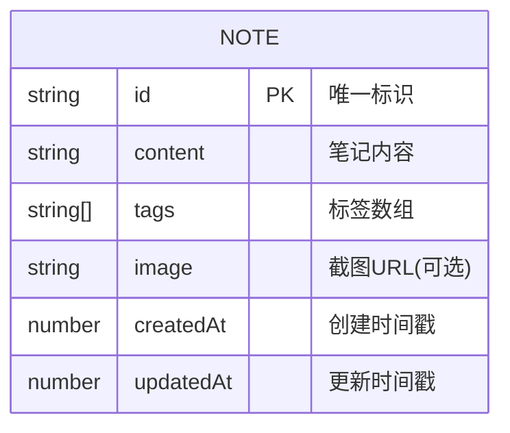

## 1. Architecture Design


## 2. Technology Description
- Frontend: Pure HTML + CSS + JavaScript (Vanilla JS)
- Storage: Browser LocalStorage
- CSS Framework: TailwindCSS 3 (CDN)
- Icons: Lucide Icons (CDN)

## 3. Route Definitions
| Route | Purpose |
|-------|---------|
| / | 首页，笔记列表和快速录入 |

## 4. Data Model

### 4.1 Data Model Definition


### 4.2 Data Structure
```typescript
interface Note {
  id: string;
  content: string;
  tags: string[];
  image?: string;
  createdAt: number;
  updatedAt: number;
}
```

## 5. File Structure
```
/
├── index.html          # 主页面
├── style.css           # 自定义样式
└── script.js           # 核心逻辑
```

## 6. Core Functions
1. **createNote**: 创建新笔记
2. **getNotes**: 获取所有笔记
3. **updateNote**: 更新笔记
4. **deleteNote**: 删除笔记
5. **filterNotes**: 按标签筛选笔记
6. **searchNotes**: 搜索笔记
7. **uploadImage**: 上传截图