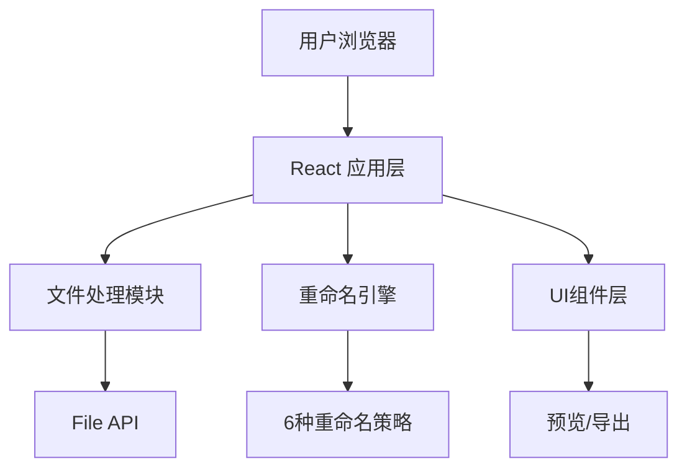

## 1. 架构设计

纯前端单页应用，无需后端服务，所有文件处理和重命名逻辑在浏览器端完成。



## 2. 技术描述

- **前端框架**：React@18 + TypeScript
- **构建工具**：Vite@5
- **样式方案**：TailwindCSS@3
- **图标库**：Lucide React
- **状态管理**：React useState / useReducer（轻量场景）
- **文件处理**：浏览器原生 File API + JSZip（可选打包下载）
- **后端**：无（纯前端应用）
- **数据库**：无

## 3. 路由定义

| 路由 | 用途 |
|------|------|
| / | 主页 - 批量重命名工具主界面 |

## 4. 重命名策略定义

### 4.1 策略类型
```typescript
type RenameMode = 
  | 'prefix-suffix'    // 前缀后缀
  | 'find-replace'     // 查找替换
  | 'append-number'    // 追加序号
  | 'auto-number'      // 自动序号
  | 'insert-content'   // 插入内容
  | 'delete-content';  // 删减内容
```

### 4.2 各策略参数

**前缀后缀 (prefix-suffix)**
```typescript
interface PrefixSuffixConfig {
  prefix: string;
  suffix: string;
  keepExtension: boolean;
}
```

**查找替换 (find-replace)**
```typescript
interface FindReplaceConfig {
  findText: string;
  replaceText: string;
  caseSensitive: boolean;
  useRegex: boolean;
}
```

**追加序号 (append-number)**
```typescript
interface AppendNumberConfig {
  position: 'start' | 'end';
  startNumber: number;
  digits: number;
  separator: string;
}
```

**自动序号 (auto-number)**
```typescript
interface AutoNumberConfig {
  prefix: string;
  startNumber: number;
  digits: number;
  suffix: string;
}
```

**插入内容 (insert-content)**
```typescript
interface InsertContentConfig {
  content: string;
  position: number;  // 插入位置（第几个字符后）
  fromEnd: boolean;  // 是否从末尾计数
}
```

**删减内容 (delete-content)**
```typescript
interface DeleteContentConfig {
  startPos: number;
  length: number;
  fromEnd: boolean;
  keepExtension: boolean;
}
```

## 5. 核心组件结构

```
src/
├── components/
│   ├── FileUploader.tsx      # 文件上传组件
│   ├── ModeSelector.tsx      # 方式选择器
│   ├── ConfigPanel.tsx       # 参数配置面板
│   ├── PreviewTable.tsx      # 预览表格
│   └── ActionBar.tsx         # 底部操作栏
├── hooks/
│   └── useRenameEngine.ts    # 重命名引擎 hook
├── utils/
│   ├── renameStrategies.ts   # 重命名策略实现
│   └── fileUtils.ts          # 文件工具函数
├── types/
│   └── index.ts              # 类型定义
├── App.tsx
├── main.tsx
└── index.css
```

## 6. 数据模型

### 6.1 文件项
```typescript
interface FileItem {
  id: string;
  file: File;
  originalName: string;
  newName: string;
  extension: string;
  size: number;
}
```

### 6.2 重命名结果
```typescript
interface RenameResult {
  originalName: string;
  newName: string;
  changed: boolean;
  error?: string;
}
```
