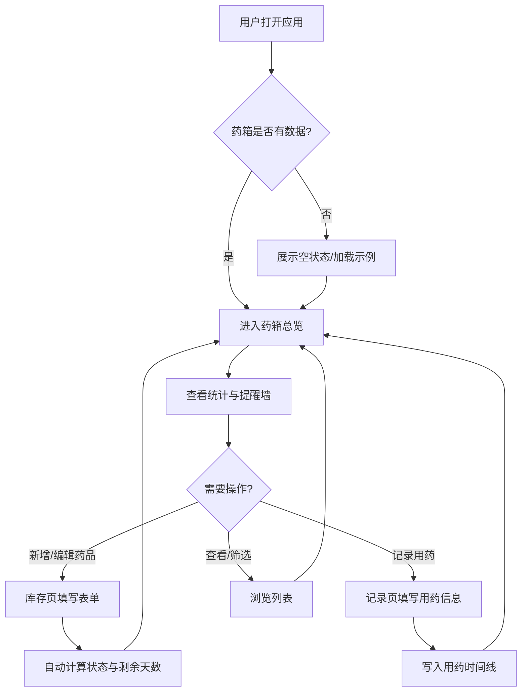

# 产品需求文档（PRD）— 家庭药品管理助手

## 1. 产品概述

家庭药品管理助手（Family Med Manager）是一款帮助家庭管理常备药品、避免过期浪费和用药混乱的 Web 小应用。面向有老人或慢性病患者的家庭、家有婴幼儿的父母、以及希望系统化管理家庭药箱的普通用户，通过药品库存管理、过期提醒与用药记录三大核心功能，解决"买时记得住、用时找不到、过期才发现"的家庭用药痛点。

产品价值：将散乱的家庭药箱数字化，以直观的"草本标本卡"形式呈现药品状态，自动预警临近过期药品，并记录用药历史，降低药品浪费与用药安全隐患。

## 2. 核心功能

### 2.1 用户角色

本应用为单角色家庭工具，无需注册登录，所有数据保存在本地浏览器。

| 角色 | 使用方式 | 核心权限 |
|------|----------|----------|
| 家庭用户 | 直接打开网页 | 药品增删改查、记录用药、查看提醒与历史 |

### 2.2 功能模块

1. **药箱总览（Dashboard）**：统计概览、临近过期提醒墙、最近用药记录、快捷入口
2. **药品库存（Inventory）**：药品标本卡片网格、搜索/筛选/排序、新增/编辑/删除
3. **用药记录（Records）**：用药时间线、新增记录、按药品筛选

### 2.3 页面详情

| 页面名称 | 模块名称 | 功能描述 |
|----------|----------|----------|
| 药箱总览 | 统计概览卡 | 展示药品总数、将过期数、已过期数、本月用药次数四项统计 |
| 药箱总览 | 临近过期提醒墙 | 列出 30 天内过期及已过期药品，按剩余天数升序，状态印章醒目 |
| 药箱总览 | 最近用药记录 | 展示最近 5 条用药记录，时间线样式 |
| 药箱总览 | 快捷入口 | 新增药品、新增用药记录按钮 |
| 药品库存 | 工具栏 | 按名称/用途搜索、按状态筛选（全部/正常/临近/过期）、排序（剩余天数/名称/数量） |
| 药品库存 | 标本卡片网格 | 每张卡展示名称、用途、数量、有效期、剩余天数、状态印章 |
| 药品库存 | 新增/编辑模态框 | 表单：名称、有效期（日期选择器）、用途、数量、分类 |
| 药品库存 | 删除确认 | 内联二次确认，避免误删 |
| 药品库存 | 空状态 | 药箱为空时的引导插画与文案 |
| 用药记录 | 时间线列表 | 按时间倒序，展示药品名、时间、剂量、备注 |
| 用药记录 | 新增记录模态框 | 选择药品（下拉）、剂量、时间（默认当前）、备注 |
| 用药记录 | 筛选 | 按药品筛选历史记录 |
| 用药记录 | 空状态 | 暂无记录时的引导文案 |

### 2.4 状态标识规则

| 状态 | 判定条件 | 颜色 | 印章文案 |
|------|----------|------|----------|
| 已过期 | 距过期天数 < 0 | 印章红 `#8B3A3A` | 已过 |
| 临近过期 | 0 ≤ 距过期天数 ≤ 30 | 琥珀 `#C8923A` | 将过 |
| 正常 | 距过期天数 > 30 | 苔绿 `#5A7D5A` | 可用 |

## 3. 核心流程

### 3.1 药品管理主流程

用户打开应用 → 进入药箱总览查看统计与提醒 → 在药品库存页新增药品（名称/有效期/用途/数量）→ 系统自动计算剩余天数并标记状态 → 临近过期药品在总览页提醒墙高亮 → 药品用完或过期后编辑数量或删除。

### 3.2 用药记录流程

用户在用药记录页点击新增 → 选择药品 → 输入剂量与时间 → 提交后记录进入时间线 → 可按药品筛选回溯历史。

## 4. 用户界面设计

### 4.1 设计风格

复古草本药铺风 — 灵感来自传统中药铺与草本图鉴。

- **主色调**：墨绿 `#2D4A3E`（主色）+ 赭石 `#B8763E`（次色）
- **背景**：米黄/宣纸 `#F5EFE0`，叠加磨砂噪点纹理
- **状态色**：印章红 `#8B3A3A`（过期）/ 琥珀 `#C8923A`（临近）/ 苔绿 `#5A7D5A`（正常）
- **按钮风格**：墨绿实心主按钮带圆角与细微阴影；赭石描边次按钮
- **字体**：思源宋体（Noto Serif SC）为标题与正文衬线主体；Cormorant Garamond 用于数字与拉丁标签；马善政体（Ma Shan Zheng）用于少量装饰性短语
- **布局风格**：标本卡片网格 + 顶部导航，桌面优先栅格
- **装饰元素**：药品卡片四角角标、圆形状态印章（轻微旋转模拟手盖）、双线菱形分隔、草本线稿点缀

### 4.2 页面设计概览

| 页面名称 | 模块名称 | UI 元素 |
|----------|----------|---------|
| 药箱总览 | 统计概览卡 | 4 张标本风卡片，衬线大数字，赭石图标，staggered 淡入 |
| 药箱总览 | 临近过期提醒墙 | 横向卡片，印章醒目，hover 上浮 |
| 药箱总览 | 最近用药记录 | 竖向时间线，左侧圆点连线 |
| 药品库存 | 工具栏 | 搜索框 + 筛选标签 + 排序下拉，赭石描边 |
| 药品库存 | 标本卡片网格 | 米黄底卡片，墨绿细边，四角角标，左上印章 |
| 用药记录 | 时间线列表 | 左侧时间轴，右侧记录卡，倒序排列 |
| 通用 | 模态框 | 居中淡入，宣纸底，墨绿标题，赭石分隔线 |

### 4.3 响应式

桌面优先设计，栅格布局在移动端自适应为单列；导航在窄屏折叠为紧凑样式；卡片网格在移动端单列展示，保证触控可操作。

### 4.4 动效

- 页面/卡片入场：staggered fade-up（CSS animation-delay）
- 卡片 hover：轻微上浮 + 阴影加深
- 状态印章 hover：轻微旋转回正
- 模态框：淡入 + 轻微缩放
