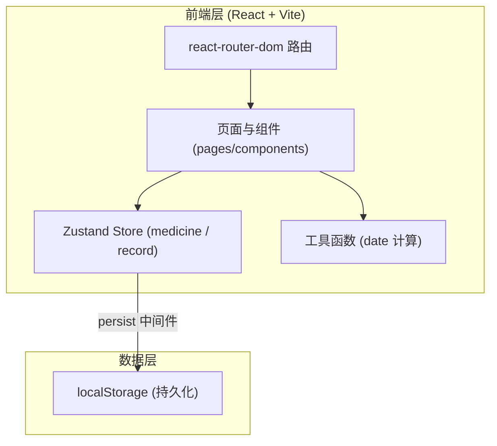
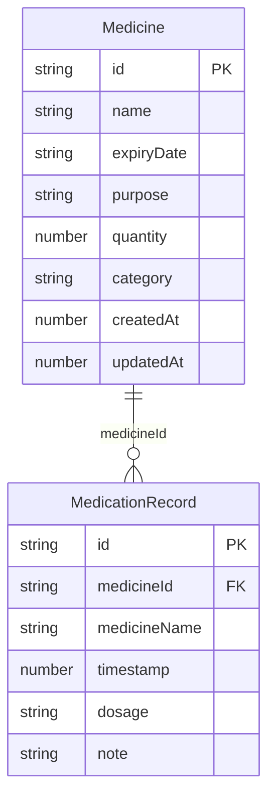

# 技术架构文档 — 家庭药品管理助手

## 1. 架构设计

纯前端单页应用，无后端服务。数据通过 Zustand persist 中间件持久化到浏览器 localStorage。



## 2. 技术说明

- **前端**：React 18 + TypeScript + tailwindcss@3 + vite
- **初始化工具**：vite-init（`react-ts` 模板，含 react-router-dom、tailwind、zustand）
- **状态管理**：Zustand + `zustand/middleware` 的 `persist`（localStorage 持久化）
- **路由**：react-router-dom v6
- **图标**：lucide-react
- **后端**：无（PRD 明确 localStorage，Demo 范围）
- **数据库**：无（localStorage 作为本地存储）

## 3. 路由定义

| 路由 | 用途 |
|------|------|
| `/` | 药箱总览页 — 统计、提醒墙、最近记录、快捷入口 |
| `/inventory` | 药品库存页 — 卡片网格、搜索/筛选/排序、增删改 |
| `/records` | 用药记录页 — 时间线、新增记录、按药品筛选 |

## 4. API 定义

无后端 API。所有数据操作通过 Zustand store 在前端完成。

## 5. 服务器架构

无后端服务器。

## 6. 数据模型

### 6.1 数据模型定义



### 6.2 数据定义语言（localStorage 结构）

localStorage 中存储两个独立 key，各保存一个 JSON 数组：

**Key: `fmm-medicines`**
```json
[
  {
    "id": "uuid-1",
    "name": "布洛芬混悬液",
    "expiryDate": "2026-09-15",
    "purpose": "儿童退烧",
    "quantity": 1,
    "category": "退烧",
    "createdAt": 1783000000000,
    "updatedAt": 1783000000000
  }
]
```

**Key: `fmm-records`**
```json
[
  {
    "id": "uuid-r1",
    "medicineId": "uuid-1",
    "medicineName": "布洛芬混悬液",
    "timestamp": 1783100000000,
    "dosage": "5ml",
    "note": "饭后服用"
  }
]
```

### 6.3 派生计算（非存储，运行时计算）

- `daysUntilExpiry(expiryDate: string): number` — 以当前日期与有效期计算剩余天数
- `getStatus(days: number): 'expired' | 'expiring' | 'safe'` — `<0` 过期 / `0–30` 临近 / `>30` 正常
- `formatDate(iso: string): string` — 格式化为 `YYYY年MM月DD日`

## 7. 状态管理设计

### 7.1 useMedicineStore

- `medicines: Medicine[]`
- `addMedicine(data): void` — 新增（自动生成 id 与时间戳）
- `updateMedicine(id, data): void` — 更新（更新 updatedAt）
- `removeMedicine(id): void` — 删除
- persist 到 `fmm-medicines`

### 7.2 useRecordStore

- `records: MedicationRecord[]`
- `addRecord(data): void` — 新增
- `removeRecord(id): void` — 删除
- persist 到 `fmm-records`

## 8. 项目结构

```
src/
├── index.css              # 全局样式、纹理、CSS 变量
├── App.tsx                # 路由 + 布局壳
├── main.tsx               # 入口
├── types/index.ts         # Medicine / MedicationRecord 类型
├── store/
│   ├── useMedicineStore.ts
│   └── useRecordStore.ts
├── utils/date.ts          # 日期与状态计算
├── components/
│   ├── Layout/{Header,Nav}.tsx
│   ├── MedicineCard.tsx
│   ├── StatusSeal.tsx
│   ├── MedicineFormModal.tsx
│   ├── RecordFormModal.tsx
│   ├── EmptyState.tsx
│   └── ConfirmDialog.tsx
└── pages/
    ├── Dashboard.tsx
    ├── Inventory.tsx
    └── Records.tsx
```
