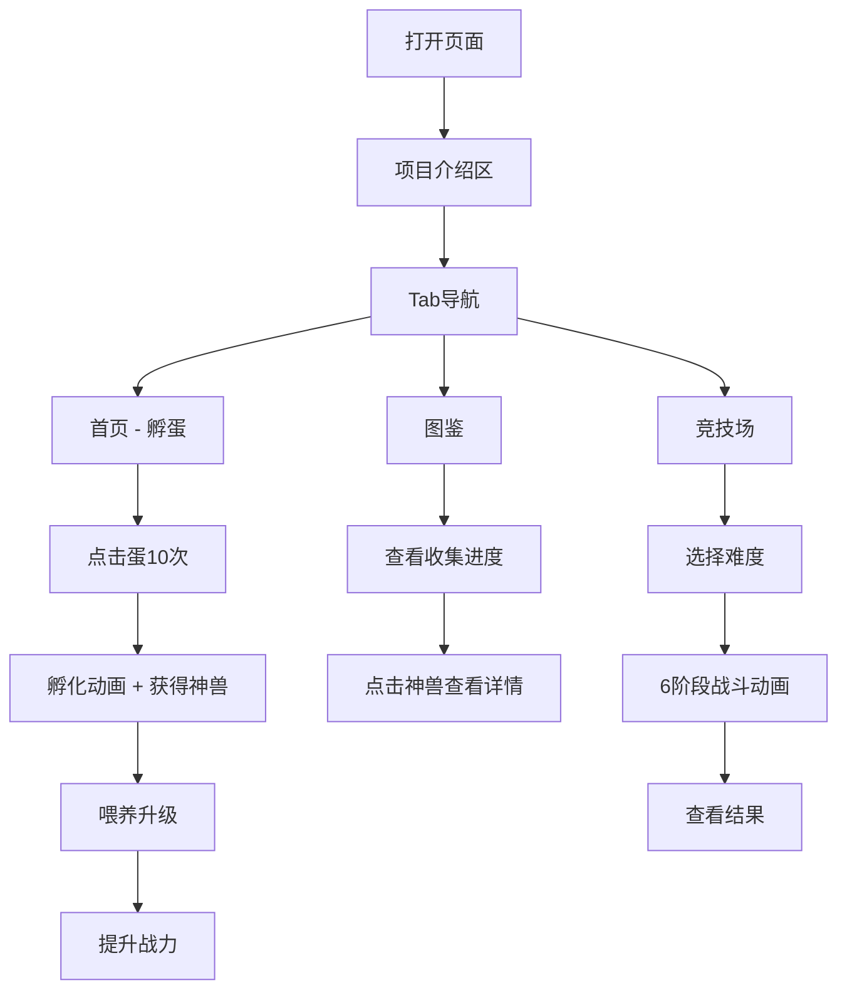

## 1. 产品概述

「四神兽养成」是一款东方神话风格的灵兽驯养体验页，专为 Trae AI 创造力大赛评审设计。评审可以通过单文件 HTML 完整体验孵蛋、喂养升级、神兽收集和竞技场战斗等核心玩法，感受 AI 辅助开发的创意成果。
- 目标用户：Trae AI 创造力大赛评审人员
- 核心价值：在单个 HTML 文件中完整呈现微信小程序项目的核心交互和东方神话视觉风格

## 2. 核心功能

### 2.1 功能模块

1. **项目展示首页**：项目名称、副标题、简介、Trae AI 协作亮点
2. **孵蛋体验区**：点击蛋10次孵化，粒子特效，随机获得神兽
3. **神兽养成区**：展示神兽属性、喂养升级、经验条、战力显示
4. **图鉴收集区**：2x2网格展示四神兽，已收集/未收集状态切换
5. **竞技场战斗区**：三难度竞技场，6阶段战斗动画，结果展示

### 2.2 页面详情

| 页面名称 | 模块名称 | 功能描述 |
|----------|----------|----------|
| 项目首页 | Hero区 | 项目标题、副标题、项目简介、技术亮点展示 |
| 项目首页 | 导航Tab | 首页/图鉴/竞技场三个Tab切换 |
| 首页Tab | 孵蛋系统 | 点击蛋孵化、裂纹动画、粒子特效、获得神兽 |
| 首页Tab | 神兽展示 | emoji、名字、属性、等级、经验条、战力、喂养按钮 |
| 图鉴Tab | 收集进度 | 顶部进度条显示 x/4 |
| 图鉴Tab | 神兽网格 | 2x2网格，已收集显示详情，未收集显示问号 |
| 图鉴Tab | 详情弹窗 | 属性、等级、战力、传说故事 |
| 竞技场Tab | 神兽战力 | 当前出战神兽及战力展示 |
| 竞技场Tab | 竞技场列表 | 初级/中级/高级三个竞技场 |
| 竞技场Tab | 战斗动画 | 6阶段战斗动画（入场→攻击→反击→再攻→决胜→结果） |
| 竞技场Tab | 结果面板 | 胜负、经验奖励、回合数、总伤害 |
| 底部 | 技术说明 | 技术栈、项目结构、AI协作说明 |

## 3. 核心流程

用户打开页面后，首先看到项目介绍，然后通过Tab切换体验不同功能：
1. 首页：点击蛋10次孵化 → 获得随机神兽 → 喂养升级 → 提升战力
2. 图鉴：查看已收集神兽 → 点击查看详情和传说
3. 竞技场：选择难度 → 观看战斗动画 → 查看结果

## 4. 用户界面设计

### 4.1 设计风格
- 主色调：深蓝紫 #16213e（背景）、品红红 #e94560（强调）、金色 #ffc107（高亮）
- 按钮风格：圆角渐变按钮，红色主按钮，半透明次按钮
- 字体：中文使用系统字体，标题加粗加大
- 布局：卡片式布局，圆角24rpx，半透明边框
- 风格：东方神话暗色系，深色背景+渐变卡片+粒子特效

### 4.2 页面设计概述

| 页面名称 | 模块名称 | UI元素 |
|----------|----------|--------|
| 项目首页 | Hero区 | 深蓝紫渐变背景、大标题、副标题、金色装饰 |
| 首页Tab | 孵蛋区 | 蛋emoji动画、裂纹SVG、粒子Canvas |
| 首页Tab | 神兽卡片 | 深色卡片、emoji大展示、经验条渐变、红色喂养按钮 |
| 图鉴Tab | 进度条 | 渐变进度条、金色文字 |
| 图鉴Tab | 神兽网格 | 2x2圆角卡片网格、各神兽主题色边框 |
| 图鉴Tab | 详情弹窗 | 毛玻璃弹窗、神兽传说文案 |
| 竞技场Tab | 战斗场景 | 全屏战斗区域、双方站位、HP血条、技能特效 |
| 竞技场Tab | 结果面板 | 底部上滑面板、金色奖励文字 |

### 4.3 响应式设计
- 桌面优先，移动端适配
- 最大宽度480px居中（模拟手机体验）
- 触摸优化：按钮足够大，间距合理
