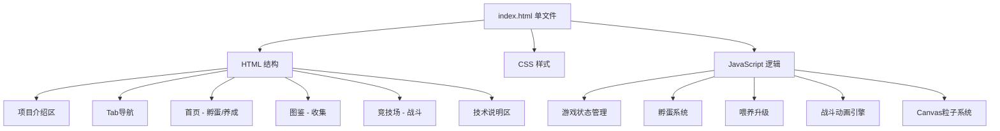

## 1. 架构设计

单文件 HTML 架构，所有代码（HTML/CSS/JS）内联在一个文件中，零外部依赖，浏览器直接打开即可体验。



## 2. 技术说明
- 前端：纯 HTML5 + CSS3 + Vanilla JavaScript
- 无框架依赖，单文件交付
- Canvas 2D 用于粒子特效
- CSS Animations 用于战斗动画
- 内存数据存储（无后端）

## 3. 路由定义
无传统路由，使用 Tab 切换显示/隐藏不同区域：
| Tab | 目的 |
|-----|------|
| 首页 | 孵蛋和养成体验 |
| 图鉴 | 神兽收集展示 |
| 竞技场 | 战斗体验 |

## 4. 数据模型

### 4.1 游戏状态
```javascript
const gameState = {
  hasEgg: true,           // 是否有蛋
  eggClickCount: 0,       // 蛋点击次数
  currentPet: null,       // 当前神兽ID
  level: 1,               // 等级
  exp: 0,                 // 经验
  lastFeedTime: 0,        // 上次喂养时间
  totalFeedCount: 0,      // 总喂养次数
  collection: [],          // 已收集神兽ID列表
  savedBeasts: {},         // 已保存神兽
}
```

### 4.2 神兽配置
| 神兽 | ID | emoji | 属性 | 基础战力 | 成长率 | 技能 | 主题色 |
|------|----|-------|------|---------|--------|------|--------|
| 青龙 | qinglong | 🐉 | 木 | 10 | 1.2 | 风雷斩 | #00d2ff |
| 白虎 | baihu | 🐅 | 金 | 12 | 1.15 | 庚金裂空 | #f5f7fa |
| 朱雀 | zhuque | 🦅 | 火 | 11 | 1.18 | 涅槃之焰 | #f12711 |
| 玄武 | xuanwu | 🐢 | 水 | 14 | 1.1 | 深渊潮涌 | #11998e |

### 4.3 竞技场配置
| 竞技场 | 敌人 | emoji | 战力 | 技能 | 经验奖励 |
|--------|------|-------|------|------|---------|
| 初级 | 小妖 | 👹 | 15 | 妖气弹 | 10 |
| 中级 | 夜叉 | 👺 | 40 | 暗影爪 | 25 |
| 高级 | 修罗 | 😈 | 80 | 修罗破天 | 50 |
