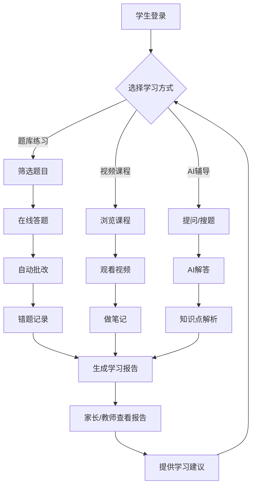

# 学智云学习平台产品需求文档

## 1. 产品概述
学智云是一个面向1-9年级学生的在线学习平台，提供语文、数学、英语主课教学，以及物理、化学、生物（小学阶段为科学）等重要科目的学习支持。平台通过智能题库、视频课程、AI辅导和个性化学习报告，帮助学生提升学习效率。

- **核心价值**：为学生提供科学、高效、有趣的学习体验，帮助家长和教师实时了解学生学习情况
- **目标用户**：1-9年级中小学生、家长、教师

## 2. 核心功能

### 2.1 用户角色

| 角色 | 注册方式 | 核心权限 |
|------|---------|---------|
| 学生 | 手机号/邮箱注册 | 访问题库、视频课程、AI辅导、查看学习报告 |
| 家长 | 手机号注册 | 绑定学生账号、查看学习报告、设置学习计划 |
| 教师 | 手机号注册（需认证） | 发布作业、查看班级学习情况、上传学习资料 |

### 2.2 功能模块

#### 2.2.1 核心功能页面
1. **首页**：学科选择、学习进度概览、推荐课程
2. **题库练习页**：按年级/科目/难度筛选题目、在线答题、自动批改
3. **视频课程页**：课程分类、视频播放、知识点标注
4. **AI智能辅导页**：拍照搜题、智能问答、知识点解析
5. **学习报告页**：学习数据分析、薄弱知识点、进度追踪
6. **个人中心页**：账号设置、学习历史、错题本

#### 2.2.2 管理端页面
1. **家长端**：孩子学习监控、学习计划设置、学习报告查看
2. **教师端**：班级管理、作业发布、学习数据分析

### 2.3 页面详情

| 页面名称 | 模块名称 | 功能描述 |
|---------|---------|---------|
| 首页 | 学科选择器 | 快速选择年级和科目（语文、数学、英语、物理、化学、生物/科学） |
| 首页 | 学习进度概览 | 显示各科目学习进度、本周学习时长、完成率 |
| 首页 | 推荐课程 | 根据学习数据智能推荐课程和题目 |
| 题库练习页 | 题目筛选器 | 按年级、科目、知识点、难度筛选 |
| 题库练习页 | 在线答题 | 支持选择题、填空题、判断题，实时计时 |
| 题库练习页 | 自动批改 | 即时批改并显示正确答案和解析 |
| 题库练习页 | 错题记录 | 自动收集错题，支持重做 |
| 题库练习页 | 难度可视化 | 用星级或颜色显示题目难度 |
| 视频课程页 | 课程分类 | 按科目、年级、知识点分类展示 |
| 视频课程页 | 视频播放器 | 支持进度条、倍速、知识点标注 |
| 视频课程页 | 课程笔记 | 学生可在视频关键点做笔记 |
| AI智能辅导页 | 拍照搜题 | 上传题目图片，AI识别并解答 |
| AI智能辅导页 | 智能问答 | 输入问题，AI提供解答和知识点延伸 |
| AI智能辅导页 | 知识点解析 | 针对薄弱知识点提供详细解析 |
| 学习报告页 | 学习数据统计 | 学习时长、题目完成量、正确率图表 |
| 学习报告页 | 知识点掌握度 | 各知识点掌握情况雷达图 |
| 学习报告页 | 学习建议 | 基于数据分析提供个性化学习建议 |
| 个人中心页 | 账号设置 | 修改个人信息、头像、密码 |
| 个人中心页 | 学习历史 | 查看历史学习记录 |
| 个人中心页 | 错题本 | 查看和复习错题 |
| 家长端 | 学习监控 | 查看孩子学习进度、时长、完成情况 |
| 家长端 | 学习计划设置 | 为孩子设置每日/每周学习目标和提醒 |
| 家长端 | 学习报告查看 | 接收孩子学习报告推送 |
| 教师端 | 班级管理 | 创建班级、添加学生、分组管理 |
| 教师端 | 作业发布 | 发布作业、设置截止时间、查看提交情况 |
| 教师端 | 学习数据分析 | 查看班级整体学习数据和个体差异 |

## 3. 核心流程

### 3.1 学生学习流程
学生登录后选择年级和科目，可以浏览推荐课程或进入题库练习。在题库中按知识点筛选题目，答题后系统自动批改并记录错题。学生可以查看学习报告了解薄弱环节，也可以通过AI辅导获取针对性帮助。家长和教师可以监控学习进度并提供指导。

### 3.2 核心流程图

### 3.3 家长端流程
家长注册后绑定学生账号，可以查看孩子的学习报告、设置学习计划、接收学习进度推送。

### 3.4 教师端流程
教师认证后创建班级并添加学生，可以发布作业、查看班级学习数据、分析个体差异并针对性辅导。

## 4. 用户界面设计

### 4.1 设计风格
- **主色调**：活力蓝色（#4A90E2）为主，橙色（#F5A623）为辅
- **辅助色**：根据学科特点，语文用暖色调、数学用蓝色系、英语用绿色系、科学用紫色系
- **按钮风格**：圆角按钮，带有柔和阴影，hover时颜色加深
- **字体**：标题使用思源黑体（Source Han Sans），正文使用苹方字体
- **布局风格**：卡片式布局，顶部导航，侧边栏快速切换功能
- **图标风格**：使用扁平化图标，配合柔和的渐变色
- **动效**：页面切换使用渐变动画，按钮hover有微动效，卡片有悬浮效果

### 4.2 页面设计概述

| 页面名称 | 模块名称 | UI设计要素 |
|---------|---------|-----------|
| 首页 | 学科选择器 | 卡片式学科按钮，每个学科用不同图标和颜色，hover时放大并显示简介 |
| 首页 | 学习进度概览 | 环形进度图，显示各科目完成百分比，不同颜色区分科目 |
| 首页 | 推荐课程 | 横向滚动卡片，显示课程封面、标题、学习人数、难度星级 |
| 题库练习页 | 题目筛选器 | 下拉选择器，标签式筛选，支持多选 |
| 题库练习页 | 在线答题 | 居中显示题目，选项使用圆形单选框或方形复选框，底部显示进度和计时 |
| 题库练习页 | 自动批改 | 答对显示绿色对勾，答错显示红色叉号并高亮正确答案，附带解析卡片 |
| 题库练习页 | 难度可视化 | 1-5星难度评级，用星星图标填充度表示，或用红黄绿渐变色块 |
| 视频课程页 | 课程分类 | 左侧树状分类菜单，右侧课程网格，每门课程卡片显示封面、标题、时长 |
| 视频课程页 | 视频播放器 | 自定义播放器，支持全屏、倍速、进度条拖拽、知识点书签 |
| AI智能辅导页 | 拍照搜题 | 上传区域支持拖拽上传，显示上传进度，识别结果用卡片展示 |
| AI智能辅导页 | 智能问答 | 对话式界面，类似聊天窗口，支持富文本显示数学公式 |
| 学习报告页 | 学习数据统计 | 使用ECharts图表，折线图显示学习趋势，柱状图显示各科目对比 |
| 学习报告页 | 知识点掌握度 | 雷达图显示各知识点掌握度，不同颜色区分掌握程度 |

### 4.3 响应式设计
- **桌面优先**：主要面向PC端，充分利用屏幕空间展示学习内容
- **移动适配**：在小屏幕设备上自动调整布局，侧边栏变为抽屉式，卡片变为纵向排列
- **触摸优化**：移动端支持手势操作，如左右滑动切换题目、双指缩放图片

### 4.4 无障碍设计
- 为所有交互元素添加适当的ARIA标签
- 确保色彩对比度符合WCAG标准
- 支持键盘导航
- 为图标添加文字提示