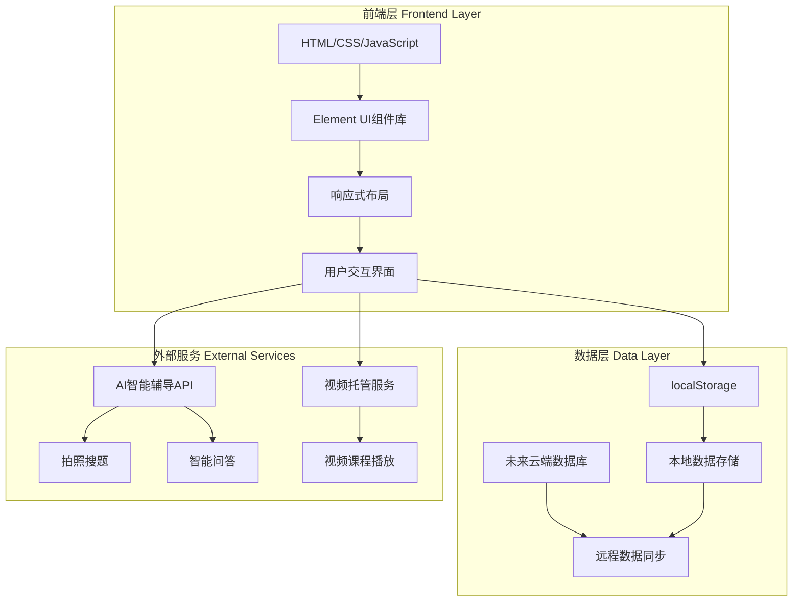

# 学智云学习平台技术架构文档

## 1. 架构设计

### 1.1 整体架构图



### 1.2 系统架构说明

本项目采用前后端分离的架构，当前阶段使用本地存储（localStorage）作为数据持久化方案，为后续接入云端数据库预留接口。

**技术栈选型理由：**
- **HTML+CSS+JavaScript**：符合用户需求，降低学习成本，快速开发
- **Element UI**：成熟的前端组件库，提供丰富的UI组件，适合学习平台场景
- **响应式设计**：支持PC和移动设备，提升用户体验
- **localStorage**：本地存储方案，无需后端即可实现数据持久化，方便原型测试
- **预留云端接口**：架构设计考虑未来扩展，可平滑迁移到云端数据库

## 2. 技术说明

### 2.1 前端技术栈
- **核心框架**：原生HTML5 + CSS3 + JavaScript (ES6+)
- **UI组件库**：Element UI 2.15+ (通过CDN引入)
- **图表库**：ECharts 5.0+ (用于学习数据可视化)
- **Markdown渲染**：marked.js (用于富文本显示)
- **数学公式**：MathJax (用于数学公式渲染)
- **视频播放器**：Video.js (用于视频课程播放)

### 2.2 项目初始化工具
- **构建工具**：无需构建工具，直接使用静态文件
- **开发服务器**：VS Code Live Server 插件 或 http-server
- **版本控制**：Git

### 2.3 数据存储方案
**阶段一（当前）**：localStorage 本地存储
- 用户信息、学习进度、错题记录、学习计划等数据存储在用户浏览器本地
- 数据格式：JSON序列化存储
- 存储容量限制：约5MB

**阶段二（未来扩展）**：云端数据库
- 后端技术：Node.js + Express 或 Python + Flask
- 数据库：MySQL 或 MongoDB
- 用户数据云端同步，支持多设备登录

### 2.4 外部服务集成
- **AI智能辅导**：集成第三方AI API（如OpenAI GPT、百度文心一言等）
- **视频托管**：使用云存储服务（如阿里云OSS、腾讯云COS）托管视频资源

## 3. 路由定义

采用单页应用（SPA）架构，通过hash路由实现页面切换。

| 路由路径 | 页面说明 | 主要功能 |
|---------|---------|---------|
| `#/home` | 首页 | 学科选择、学习进度概览、推荐课程 |
| `#/practice` | 题库练习页 | 题目筛选、在线答题、自动批改 |
| `#/courses` | 视频课程页 | 课程浏览、视频播放、笔记记录 |
| `#/ai-tutor` | AI智能辅导页 | 拍照搜题、智能问答、知识点解析 |
| `#/report` | 学习报告页 | 学习数据统计、知识点掌握度、学习建议 |
| `#/profile` | 个人中心页 | 账号设置、学习历史、错题本 |
| `#/parent` | 家长端 | 学习监控、学习计划设置、报告查看 |
| `#/teacher` | 教师端 | 班级管理、作业发布、学习数据分析 |
| `#/login` | 登录页 | 用户登录/注册 |
| `#/register` | 注册页 | 用户注册（选择角色：学生/家长/教师） |

## 4. API定义（未来云端扩展）

### 4.1 用户相关API

```typescript
// 用户登录
POST /api/auth/login
Request: {
  phone: string;
  password: string;
}
Response: {
  success: boolean;
  token: string;
  user: User;
}

// 用户注册
POST /api/auth/register
Request: {
  phone: string;
  password: string;
  role: 'student' | 'parent' | 'teacher';
  name: string;
}
Response: {
  success: boolean;
  message: string;
}

// 获取用户信息
GET /api/user/profile
Headers: { Authorization: Bearer <token> }
Response: {
  user: User;
}

// 更新用户信息
PUT /api/user/profile
Headers: { Authorization: Bearer <token> }
Request: {
  name?: string;
  avatar?: string;
}
Response: {
  success: boolean;
  user: User;
}
```

### 4.2 题库相关API

```typescript
// 获取题目列表
GET /api/questions?grade=1-9&subject=math&difficulty=1-5&page=1
Response: {
  questions: Question[];
  total: number;
  page: number;
}

// 提交答案
POST /api/questions/:id/submit
Request: {
  answer: string | string[];
}
Response: {
  correct: boolean;
  correctAnswer: string;
  explanation: string;
}

// 获取错题列表
GET /api/user/mistakes
Headers: { Authorization: Bearer <token> }
Response: {
  mistakes: Mistake[];
}
```

### 4.3 课程相关API

```typescript
// 获取课程列表
GET /api/courses?grade=1-9&subject=math
Response: {
  courses: Course[];
}

// 获取课程详情
GET /api/courses/:id
Response: {
  course: Course;
  videos: Video[];
}

// 更新学习进度
POST /api/courses/:id/progress
Headers: { Authorization: Bearer <token> }
Request: {
  progress: number;
  completed: boolean;
}
Response: {
  success: boolean;
}
```

### 4.4 AI辅导相关API

```typescript
// 拍照搜题
POST /api/ai/photo-search
Request: {
  image: File;
}
Response: {
  question: string;
  answer: string;
  explanation: string;
  relatedKnowledge: string[];
}

// 智能问答
POST /api/ai/chat
Request: {
  message: string;
  context?: string;
}
Response: {
  answer: string;
  relatedQuestions?: string[];
}
```

### 4.5 学习报告相关API

```typescript
// 获取学习报告
GET /api/reports/learning
Headers: { Authorization: Bearer <token> }
Query: {
  startDate: string;
  endDate: string;
}
Response: {
  totalTime: number;
  questionsCompleted: number;
  correctRate: number;
  subjectStats: SubjectStat[];
  knowledgePoints: KnowledgePoint[];
}

// 获取家长端报告（学生列表）
GET /api/parent/students
Headers: { Authorization: Bearer <token> }
Response: {
  students: Student[];
}
```

## 5. 数据模型

### 5.1 数据模型定义

```mermaid
erDiagram
    USER ||--o{ LEARNING_RECORD : has
    USER ||--o{ MISTAKE : has
    USER ||--o{ NOTE : creates
    USER ||--o{ STUDY_PLAN : sets
    STUDENT }|--|| USER : is
    PARENT ||--o{ STUDENT : monitors
    TEACHER ||--o{ CLASS : manages
    CLASS ||--o{ STUDENT : contains
    QUESTION ||--o{ LEARNING_RECORD : records
    QUESTION ||--o{ MISTAKE : generates
    COURSE ||--o{ VIDEO : contains
    VIDEO ||--o{ NOTE : has
    VIDEO ||--o{ LEARNING_RECORD : tracks

    USER {
        string id PK
        string phone
        string password
        string name
        string avatar
        string role "student/parent/teacher"
        datetime created_at
    }

    STUDENT {
        string user_id PK
        string grade
        string school
    }

    PARENT {
        string user_id PK
        string[] children_ids
    }

    TEACHER {
        string user_id PK
        string school
        string subject
    }

    CLASS {
        string id PK
        string name
        string teacher_id FK
        string[] student_ids
    }

    QUESTION {
        string id PK
        string subject
        string grade
        string knowledge_point
        int difficulty
        string type "choice/fill/judge"
        string content
        string[] options
        string answer
        string explanation
    }

    COURSE {
        string id PK
        string subject
        string grade
        string title
        string description
        string cover_image
    }

    VIDEO {
        string id PK
        string course_id FK
        string title
        string url
        int duration
        string[] knowledge_points
    }

    LEARNING_RECORD {
        string id PK
        string user_id FK
        string item_type "question/video"
        string item_id FK
        datetime start_time
        datetime end_time
        boolean completed
        int score
    }

    MISTAKE {
        string id PK
        string user_id FK
        string question_id FK
        string wrong_answer
        int attempt_count
        datetime last_attempt
    }

    NOTE {
        string id PK
        string user_id FK
        string video_id FK
        string content
        int timestamp
    }

    STUDY_PLAN {
        string id PK
        string user_id FK
        string subject
        int daily_goal
        int weekly_goal
        string[] reminder_times
    }
```

### 5.2 数据定义语言（DDL）

```sql
-- 用户表
CREATE TABLE users (
    id VARCHAR(36) PRIMARY KEY,
    phone VARCHAR(20) UNIQUE NOT NULL,
    password VARCHAR(255) NOT NULL,
    name VARCHAR(50),
    avatar VARCHAR(255),
    role ENUM('student', 'parent', 'teacher') NOT NULL,
    created_at TIMESTAMP DEFAULT CURRENT_TIMESTAMP,
    updated_at TIMESTAMP DEFAULT CURRENT_TIMESTAMP ON UPDATE CURRENT_TIMESTAMP
);

-- 学生扩展表
CREATE TABLE students (
    user_id VARCHAR(36) PRIMARY KEY,
    grade TINYINT CHECK (grade BETWEEN 1 AND 9),
    school VARCHAR(100),
    FOREIGN KEY (user_id) REFERENCES users(id) ON DELETE CASCADE
);

-- 家长扩展表
CREATE TABLE parents (
    user_id VARCHAR(36) PRIMARY KEY,
    FOREIGN KEY (user_id) REFERENCES users(id) ON DELETE CASCADE
);

-- 家长-学生关联表
CREATE TABLE parent_student (
    parent_id VARCHAR(36),
    student_id VARCHAR(36),
    PRIMARY KEY (parent_id, student_id),
    FOREIGN KEY (parent_id) REFERENCES users(id) ON DELETE CASCADE,
    FOREIGN KEY (student_id) REFERENCES users(id) ON DELETE CASCADE
);

-- 教师扩展表
CREATE TABLE teachers (
    user_id VARCHAR(36) PRIMARY KEY,
    school VARCHAR(100),
    subject VARCHAR(20),
    FOREIGN KEY (user_id) REFERENCES users(id) ON DELETE CASCADE
);

-- 班级表
CREATE TABLE classes (
    id VARCHAR(36) PRIMARY KEY,
    name VARCHAR(50) NOT NULL,
    teacher_id VARCHAR(36),
    created_at TIMESTAMP DEFAULT CURRENT_TIMESTAMP,
    FOREIGN KEY (teacher_id) REFERENCES users(id) ON DELETE SET NULL
);

-- 班级-学生关联表
CREATE TABLE class_student (
    class_id VARCHAR(36),
    student_id VARCHAR(36),
    PRIMARY KEY (class_id, student_id),
    FOREIGN KEY (class_id) REFERENCES classes(id) ON DELETE CASCADE,
    FOREIGN KEY (student_id) REFERENCES users(id) ON DELETE CASCADE
);

-- 题目表
CREATE TABLE questions (
    id VARCHAR(36) PRIMARY KEY,
    subject ENUM('chinese', 'math', 'english', 'physics', 'chemistry', 'biology', 'science') NOT NULL,
    grade TINYINT CHECK (grade BETWEEN 1 AND 9),
    knowledge_point VARCHAR(100),
    difficulty TINYINT CHECK (difficulty BETWEEN 1 AND 5),
    type ENUM('choice', 'fill', 'judge') NOT NULL,
    content TEXT NOT NULL,
    options JSON,
    answer TEXT NOT NULL,
    explanation TEXT,
    created_at TIMESTAMP DEFAULT CURRENT_TIMESTAMP
);

-- 课程表
CREATE TABLE courses (
    id VARCHAR(36) PRIMARY KEY,
    subject ENUM('chinese', 'math', 'english', 'physics', 'chemistry', 'biology', 'science') NOT NULL,
    grade TINYINT CHECK (grade BETWEEN 1 AND 9),
    title VARCHAR(100) NOT NULL,
    description TEXT,
    cover_image VARCHAR(255),
    created_at TIMESTAMP DEFAULT CURRENT_TIMESTAMP
);

-- 视频表
CREATE TABLE videos (
    id VARCHAR(36) PRIMARY KEY,
    course_id VARCHAR(36),
    title VARCHAR(100) NOT NULL,
    url VARCHAR(255) NOT NULL,
    duration INT,
    knowledge_points JSON,
    created_at TIMESTAMP DEFAULT CURRENT_TIMESTAMP,
    FOREIGN KEY (course_id) REFERENCES courses(id) ON DELETE CASCADE
);

-- 学习记录表
CREATE TABLE learning_records (
    id VARCHAR(36) PRIMARY KEY,
    user_id VARCHAR(36),
    item_type ENUM('question', 'video') NOT NULL,
    item_id VARCHAR(36),
    start_time TIMESTAMP NOT NULL,
    end_time TIMESTAMP,
    completed BOOLEAN DEFAULT FALSE,
    score INT,
    created_at TIMESTAMP DEFAULT CURRENT_TIMESTAMP,
    FOREIGN KEY (user_id) REFERENCES users(id) ON DELETE CASCADE
);

-- 错题表
CREATE TABLE mistakes (
    id VARCHAR(36) PRIMARY KEY,
    user_id VARCHAR(36),
    question_id VARCHAR(36),
    wrong_answer TEXT,
    attempt_count INT DEFAULT 1,
    last_attempt TIMESTAMP DEFAULT CURRENT_TIMESTAMP,
    FOREIGN KEY (user_id) REFERENCES users(id) ON DELETE CASCADE,
    FOREIGN KEY (question_id) REFERENCES questions(id) ON DELETE CASCADE
);

-- 笔记表
CREATE TABLE notes (
    id VARCHAR(36) PRIMARY KEY,
    user_id VARCHAR(36),
    video_id VARCHAR(36),
    content TEXT NOT NULL,
    timestamp INT,
    created_at TIMESTAMP DEFAULT CURRENT_TIMESTAMP,
    FOREIGN KEY (user_id) REFERENCES users(id) ON DELETE CASCADE,
    FOREIGN KEY (video_id) REFERENCES videos(id) ON DELETE CASCADE
);

-- 学习计划表
CREATE TABLE study_plans (
    id VARCHAR(36) PRIMARY KEY,
    user_id VARCHAR(36),
    subject VARCHAR(20),
    daily_goal INT,
    weekly_goal INT,
    reminder_times JSON,
    created_at TIMESTAMP DEFAULT CURRENT_TIMESTAMP,
    FOREIGN KEY (user_id) REFERENCES users(id) ON DELETE CASCADE
);

-- 索引
CREATE INDEX idx_questions_subject_grade ON questions(subject, grade);
CREATE INDEX idx_courses_subject_grade ON courses(subject, grade);
CREATE INDEX idx_learning_records_user ON learning_records(user_id, start_time);
CREATE INDEX idx_mistakes_user ON mistakes(user_id, last_attempt);
```

## 6. 项目结构

```
学智云学习平台/
├── index.html                 # 主入口文件
├── css/
│   ├── main.css              # 主样式文件
│   ├── components.css        # 组件样式
│   └── responsive.css        # 响应式样式
├── js/
│   ├── app.js                # 应用主逻辑
│   ├── router.js             # 路由管理
│   ├── api.js                # API接口封装
│   ├── storage.js            # localStorage封装
│   ├── components/
│   │   ├── navbar.js         # 导航栏组件
│   │   ├── home.js           # 首页组件
│   │   ├── practice.js       # 题库练习组件
│   │   ├── courses.js        # 视频课程组件
│   │   ├── ai-tutor.js       # AI辅导组件
│   │   ├── report.js         # 学习报告组件
│   │   └── profile.js        # 个人中心组件
│   └── utils/
│       ├── auth.js           # 认证工具
│       ├── charts.js         # 图表工具
│       └── helpers.js        # 辅助函数
├── assets/
│   ├── images/               # 图片资源
│   ├── icons/                # 图标资源
│   └── fonts/                # 字体资源
├── data/
│   ├── questions.json        # 题库数据
│   ├── courses.json          # 课程数据
│   └── users.json            # 示例用户数据
└── README.md                 # 项目说明文档
```

## 7. 开发计划

### 阶段一：基础框架搭建（第1-2周）
- 项目初始化，搭建基础HTML结构
- 引入Element UI和其他依赖库
- 实现路由系统和页面切换
- 完成导航栏和基础布局

### 阶段二：核心功能实现（第3-6周）
- 题库练习功能（题目筛选、答题、批改）
- 视频课程功能（课程浏览、播放、笔记）
- 学习报告功能（数据统计、图表展示）
- localStorage数据持久化

### 阶段三：高级功能（第7-8周）
- AI智能辅导集成（拍照搜题、智能问答）
- 家长端和教师端功能
- 用户体验优化（动画、交互细节）

### 阶段四：测试与优化（第9-10周）
- 功能测试和Bug修复
- 性能优化
- 响应式适配测试

### 阶段五：部署上线（第11周）
- 准备上线文档
- 部署到服务器
- 用户反馈收集