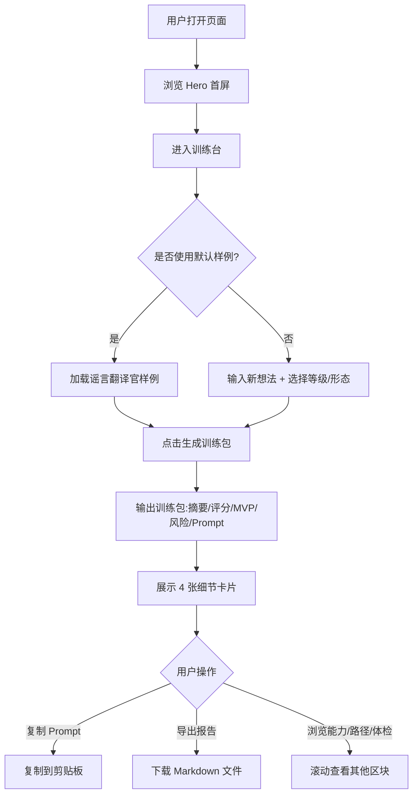

# PRD - VibeGym｜AI 造物训练场

## 1. 产品概述

VibeGym 是面向 Vibe Coding 新手的 AI 造物训练场：用户输入模糊想法，系统生成一份完整的「训练包」，帮助新手拆需求、指挥 AI、修崩溃、做交付，把灵感变成能拿出手的作品。

- 目标用户：有想法、会用 AI 工具，但不太会拆需求、写 Prompt、修 Bug、发布作品的新手
- 价值：降低 Vibe Coding 入门门槛，把「廉价 Demo」升级成「能交付的产品」
- 场景：TRAE AI 创造力大赛初赛 Demo 展示，单页可直接打开运行

## 2. 核心功能

### 2.1 功能模块
1. **单页 Demo**：顶部导航、Hero 首屏、训练台、能力系统、学习路径、发布体检

### 2.2 页面详情
| 页面区块 | 模块名称 | 功能描述 |
|---------|---------|---------|
| 顶部导航 | Logo + 导航 + 主按钮 | VibeGym 品牌、训练台/能力系统/学习路径/发布体检锚点、开始训练 |
| Hero 首屏 | 标题 + 副标题 + 双按钮 | 价值主张展示，开始训练 / 查看系统 |
| 训练台 | 输入区 + 输出区 | 想法 textarea、技能等级选择、目标形态选择、生成训练包按钮；输出训练包内容 |
| 训练包细节 | 4 张小卡片 | 相似项目雷达、Prompt 体检、V0 路线图、交付包（含导出报告） |
| 能力系统 | 5 张能力卡 | 近似项目雷达、烂 Prompt 训练器、崩溃求救单、项目记忆卡、交付前体检 |
| 学习路径 | 4 阶段 | 校准想法、切出 V0、指挥 AI、救回项目 |
| 发布体检 | Checkbox 列表 | 默认样例可用、无密钥暴露、移动端首屏、60 秒演示路径、项目记忆卡 |

## 3. 核心流程

用户打开页面 → 在训练台输入模糊想法（或使用默认样例）→ 选择技能等级与目标形态 → 点击生成训练包 → 右侧输出项目摘要、可造性评分、MVP、风险、Prompt → 下方展开 4 张细节卡片 → 可复制 Prompt / 导出 Markdown 报告。

## 4. 用户界面设计

### 4.1 设计风格
- 主色调：深色背景（#070b14 / #0b1220）+ 蓝绿色科技感（#2dd4bf 青、#22d3ee 蓝、#7c3aed 紫强调）
- 强调色：电光青 #2dd4bf 作为主行动色，琥珀色 #fbbf24 作为评分/警示
- 按钮：扁平 + 微光晕，主按钮带渐变与发光边
- 字体：标题用等宽显示字体（JetBrains Mono / Space Mono 风格），正文用无衬线（思源黑体 / Noto Sans SC）
- 布局：单页纵向滚动，训练台左右分栏（移动端堆叠），卡片网格
- 装饰：代码网格背景、像素感小方块、扫描线、发光边框，但不影响阅读
- 图标：使用 emoji 或简单 SVG 符号，保持极客感

### 4.2 页面设计概览
| 页面区块 | 模块名称 | UI 元素 |
|---------|---------|---------|
| 顶部导航 | 导航栏 | 固定顶部、半透明毛玻璃、Logo 左、导航中、主按钮右 |
| Hero | 首屏 | 大标题 + 渐变文字、副标题、双按钮、背景代码网格 + 浮动像素块 |
| 训练台 | 输入输出分栏 | 左：textarea + 2 select + button；右：训练包卡片，评分大数字，Prompt 代码块带复制按钮 |
| 训练包细节 | 4 卡片网格 | 雷达卡（标签云）、Prompt 体检（3 进度条）、V0 路线图（3 步时间线）、交付包（清单 + 导出按钮） |
| 能力系统 | 5 卡片网格 | 每卡：图标 + 标题 + 描述，hover 发光 |
| 学习路径 | 4 阶段时间线 | 横向/纵向连接线，编号 + 标题 + 描述 |
| 发布体检 | Checkbox 列表 | 自定义勾选框，带状态色 |

### 4.3 响应式
- 桌面优先，移动端自适应
- 训练台左右分栏在 ≤768px 堆叠为上下
- 卡片网格在移动端单列
- 导航在移动端简化，主按钮始终可见

## 5. 默认样例数据

训练台默认显示「家庭群谣言翻译官」训练包：
- 项目摘要：把长辈转发的消息，转成可信度判断、核实清单和温和回复，减少家庭沟通摩擦。
- 可造性评分：88
- MVP：粘贴消息、可信度等级、可疑信号、核实步骤、温和回复
- 风险提示：不做医学结论，只做信息核查和沟通辅助
- 可复用开工 Prompt：见输出区原文

## 6. 交互要求
- 生成训练包：点击后右侧渲染训练包内容（基于输入匹配预设数据或回退到默认样例）
- 复制 Prompt：点击后写入剪贴板，按钮文字短暂变「已复制」
- 导出报告：点击后下载 .md 文件，包含项目摘要、MVP、风险、路线图、Prompt
- 发布体检：checkbox 可勾选，状态实时反馈
- 锚点导航：顶部导航点击平滑滚动到对应区块
