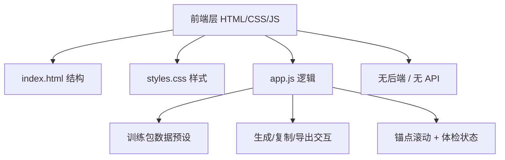

# 技术架构 - VibeGym｜AI 造物训练场

## 1. 架构设计



纯前端单页架构，所有数据预设于 app.js，无后端、无真实 AI API、无构建依赖。

## 2. 技术说明

- 前端：纯 HTML5 + CSS3 + 原生 JavaScript (ES6+)
- 初始化工具：无，直接创建 3 个文件
- 后端：无
- 数据库：无，所有训练包数据写在 app.js 的对象数组中
- 依赖：无第三方库（仅使用 Google Fonts CDN）

技术选型理由：用户明确要求纯 HTML/CSS/JS，方便直接打开或打包提交，避免复杂依赖导致提交困难。

## 3. 文件结构

| 文件 | 职责 |
|------|------|
| index.html | 页面结构：导航、Hero、训练台、4 卡片、能力系统、学习路径、发布体检、页脚 |
| styles.css | 全部样式：变量、布局、卡片、动画、响应式 |
| app.js | 训练包数据、生成逻辑、复制 Prompt、导出 Markdown、锚点滚动、体检勾选 |

## 4. 数据模型

### 4.1 训练包数据结构
```javascript
{
  idea: "家庭群谣言翻译官",
  project: {
    name: "家庭群谣言翻译官",
    summary: "...",
    score: 88,
    mvp: ["粘贴消息", "可信度等级", "可疑信号", "核实步骤", "温和回复"],
    risk: "...",
    prompt: "..."
  },
  similar: ["谣言核查助手", "家庭沟通翻译器", "反诈提醒卡"],
  promptHealth: { context: 90, boundary: 85, acceptance: 80 },
  roadmap: [{ step: 1, title: "...", desc: "..." }],
  checklist: [...]
}
```

### 4.2 预设训练包
- 默认：家庭群谣言翻译官（评分 88）
- 关键词匹配：若输入包含「谣言/家庭/长辈」等关键词，返回默认包；否则基于模板生成通用训练包

## 5. 核心交互实现

### 5.1 生成训练包
- 监听按钮 click，读取 textarea + 两个 select 值
- 关键词匹配预设数据，无匹配时套用模板填充
- 渲染到右侧输出区 DOM

### 5.2 复制 Prompt
- 使用 navigator.clipboard.writeText
- 成功后按钮文字改「已复制」，setTimeout 1.5s 恢复

### 5.3 导出报告
- 拼接 Markdown 字符串
- 创建 Blob(type: 'text/markdown') + URL.createObjectURL + a 标签触发下载
- 文件名：vibegym-training-report.md

### 5.4 锚点滚动
- 导航项 click 调用 scrollIntoView({ behavior: 'smooth' })

### 5.5 发布体检
- checkbox change 事件，更新父元素 class 控制状态色

## 6. 响应式断点
- 桌面 ≥1024px：训练台左右分栏，卡片 4 列 / 5 列
- 平板 768-1023px：卡片 2 列
- 移动 ≤768px：全栈单列，导航简化

## 7. 性能与可访问性
- 无外部 JS 库，首屏即用
- 语义化 HTML（header/section/nav/main/footer）
- 按钮带 aria-label，checkbox 关联 label
- 字体使用 Google Fonts，带 fallback
