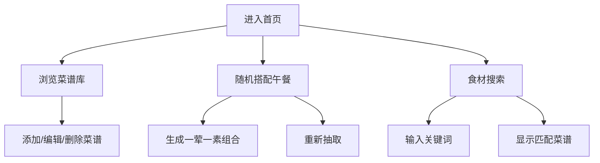

## 1. Product Overview
一个纯HTML5的菜谱库应用，帮助用户记录日常菜单并解决"今天吃什么"的选择困难问题。支持随机搭配午餐和根据食材搜索菜谱。

## 2. Core Features

### 2.1 User Roles
| Role | Registration Method | Core Permissions |
|------|---------------------|------------------|
| Normal User | No registration | Manage recipes, random selection, search |

### 2.2 Feature Module
1. **菜谱库**: 添加、编辑、删除菜谱，分类管理（荤/素）
2. **随机搭配**: 自动抽取一荤一素组合成午餐方案
3. **食材搜索**: 根据关键词（如土豆、鸡蛋）搜索相关菜谱

### 2.3 Page Details
| Page Name | Module Name | Feature description |
|-----------|-------------|---------------------|
| 首页 | 菜谱列表 | 展示所有菜谱，支持分类筛选，添加新菜谱入口 |
| 首页 | 随机搭配 | 一键生成午餐组合，支持重新抽取 |
| 首页 | 食材搜索 | 输入食材关键词，筛选相关菜谱 |

## 3. Core Process
用户进入应用后可以浏览菜谱库，添加新菜谱（填写菜名、分类、食材、做法），或使用随机搭配功能生成午餐方案，也可以通过食材关键词搜索菜谱。数据保存在本地存储中。

## 4. User Interface Design

### 4.1 Design Style
- 主色调：温暖的橙色（#FF9F43）作为主色，配合清新的绿色（#1DD1A1）作为辅助色
- 按钮样式：圆角矩形，悬停时有轻微缩放效果
- 字体：使用 Google Fonts 的 "Noto Sans SC"
- 布局：卡片式布局，顶部导航，响应式设计
- 图标：使用 Lucide 图标库

### 4.2 Page Design Overview
| Page Name | Module Name | UI Elements |
|-----------|-------------|-------------|
| 首页 | 头部 | Logo、标题、搜索框 |
| 首页 | 随机搭配区 | 醒目的"今天吃什么"按钮，展示结果卡片 |
| 首页 | 菜谱列表 | 分类筛选（全部/荤/素），菜谱卡片网格 |
| 首页 | 添加菜谱 | 模态框表单（菜名、分类、食材、做法） |

### 4.3 Responsiveness
- 桌面端：三列网格布局
- 平板端：两列网格布局
- 移动端：单列布局，底部导航

### 4.4 3D Scene Guidance
不适用，纯2D应用
