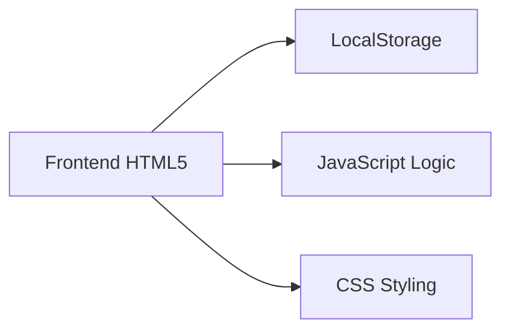
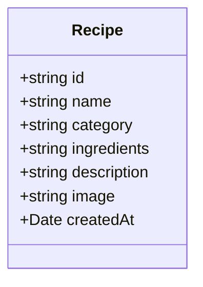

## 1. Architecture Design



## 2. Technology Description

* Frontend: Pure HTML5 + CSS3 + JavaScript (ES6+)

* Initialization Tool: None (plain HTML project)

* Backend: None (local storage only)

* Database: LocalStorage

## 3. Route Definitions

| Route | Purpose   |
| ----- | --------- |
| /     | 首页，包含所有功能 |

## 4. API Definitions

不适用，纯前端应用，无后端API

## 5. Server Architecture Diagram

不适用，纯前端应用

## 6. Data Model

### 6.1 Data Model Definition



### 6.2 Data Definition Language

```javascript
// Recipe Object Structure
{
  id: "uuid",
  name: "string",        // 菜名
  category: "meat|vegetable",  // 分类：荤/素
  ingredients: "string", // 食材（逗号分隔）
  description: "string", // 做法描述
  image: "string",       // 图片URL或Base64
  createdAt: "timestamp"
}

// LocalStorage Key
// "recipes" -> Array<Recipe>
```

### 6.3 Initial Data

```javascript
[
  {
    id: "1",
    name: "红烧肉",
    category: "meat",
    ingredients: "五花肉,生姜,大葱,冰糖,生抽,老抽,料酒",
    description: "五花肉切块焯水，炒糖色后加入肉块翻炒，加调料炖煮1小时",
    image: "",
    createdAt: Date.now()
  },
  {
    id: "2",
    name: "蒜蓉西兰花",
    category: "vegetable",
    ingredients: "西兰花,蒜蓉,盐,蚝油",
    description: "西兰花焯水，热油爆香蒜蓉，加入西兰花翻炒，调味出锅",
    image: "",
    createdAt: Date.now()
  },
  {
    id: "3",
    name: "土豆丝",
    category: "vegetable",
    ingredients: "土豆,青椒,红椒,大蒜,醋,盐",
    description: "土豆切丝泡水，热油炒香大蒜，加入土豆丝翻炒，加醋和调料",
    image: "",
    createdAt: Date.now()
  },
  {
    id: "4",
    name: "番茄炒蛋",
    category: "meat",
    ingredients: "番茄,鸡蛋,葱花,盐,糖",
    description: "鸡蛋打散炒熟盛出，番茄炒软出汁，加入鸡蛋翻炒调味",
    image: "",
    createdAt: Date.now()
  },
  {
    id: "5",
    name: "宫保鸡丁",
    category: "meat",
    ingredients: "鸡胸肉,花生米,干辣椒,花椒,葱,姜,蒜",
    description: "鸡丁腌制后滑炒，加入调料和花生米翻炒",
    image: "",
    createdAt: Date.now()
  },
  {
    id: "6",
    name: "炒土豆",
    category: "vegetable",
    ingredients: "土豆,洋葱,胡萝卜,盐,黑胡椒",
    description: "土豆切块煎至金黄，加入洋葱胡萝卜翻炒调味",
    image: "",
    createdAt: Date.now()
  }
]
```

