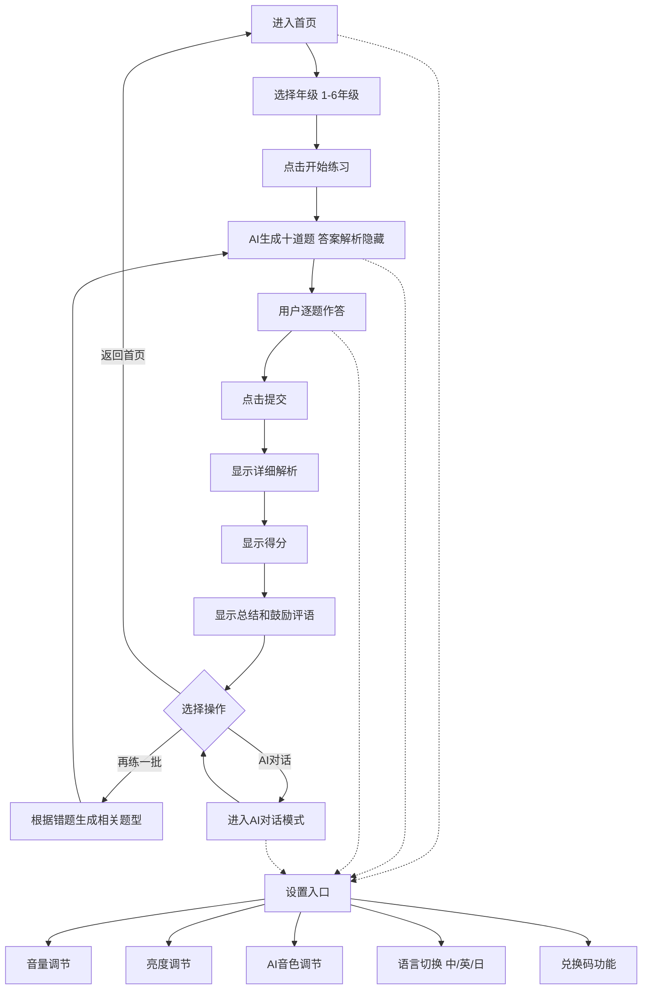

## 1. 产品概述

AI智能小学数学教学网页是一款面向小学1-6年级学生的在线数学学习工具，通过AI智能出题、详细解析和正向鼓励，帮助学生在轻松愉快的氛围中提升数学成绩。

- 核心目标：为小学生提供个性化的数学练习体验，通过AI智能出题和鼓励式教育激发学习兴趣
- 目标用户：小学1-6年级需要数学补习、渴望正向鼓励和陪伴的学生
- 产品价值：让数学学习变得有趣、有温度，每个孩子都能获得专属的AI学习伙伴

## 2. 核心功能

### 2.1 用户角色

| 角色 | 注册方式 | 核心权限 |
|------|----------|----------|
| 学生用户 | 无需注册 | 使用所有学习功能、设置系统参数、与AI对话 |

### 2.2 功能模块

1. **首页**：欢迎界面、年级选择、开始练习入口、设置入口、AI对话入口
2. **答题练习页**：十道题目展示、答题区、提交按钮、答案解析展示、得分与评语
3. **AI对话页**：聊天界面、消息列表、输入框
4. **设置弹窗**：音量调节、亮度调节、AI音色调节、语言切换、兑换码功能

### 2.3 页面详情

| 页面名称 | 模块名称 | 功能描述 |
|----------|----------|----------|
| 首页 | 欢迎区 | 可爱的AI角色形象、欢迎语、产品名称 |
| 首页 | 年级选择 | 1-6年级卡片式选择，点击选中 |
| 首页 | 功能入口 | 开始练习按钮、AI对话按钮、设置按钮 |
| 答题练习页 | 题目列表 | 十道不同类型的数学题，序号展示 |
| 答题练习页 | 答题区 | 每道题下方的答案输入框 |
| 答题练习页 | 提交按钮 | 底部固定提交按钮 |
| 答题练习页 | 结果展示 | 提交后显示答案解析、得分、总结评语 |
| 答题练习页 | 再练一批 | 根据错题情况生成新题目 |
| AI对话页 | 聊天区 | 消息气泡展示，支持滚动 |
| AI对话页 | 输入区 | 文本输入框、发送按钮 |
| 设置弹窗 | 音量调节 | 滑块调节音量大小 |
| 设置弹窗 | 亮度调节 | 滑块调节屏幕亮度 |
| 设置弹窗 | 音色调节 | 下拉选择AI角色音色 |
| 设置弹窗 | 语言切换 | 中/英/日三种语言切换 |
| 设置弹窗 | 兑换码 | 输入框+确认按钮，解锁隐藏功能 |

## 3. 核心流程

用户进入首页后选择年级，点击开始练习，AI生成十道不同类型的数学题，用户逐题作答后提交，系统显示详细解析、得分和鼓励评语，用户可选择再练一批（根据错题生成相关题型），或进入AI对话模式与AI自由交流，随时可调整系统设置。

## 4. 用户界面设计

### 4.1 设计风格

- **主色调**：温暖的橙黄色系（#FFB347）搭配天蓝色（#87CEEB），营造活泼温馨的学习氛围
- **辅助色**：薄荷绿（#98FB98）表示正确/鼓励，淡粉色（#FFB6C1）表示温柔提示
- **按钮风格**：圆角胶囊形按钮，带有轻微渐变和阴影，悬停时有弹跳效果
- **字体**：圆润可爱的无衬线字体，标题使用活泼的手写风格字体
- **布局风格**：卡片式布局，圆角大，留白充足，元素有呼吸感
- **图标/emoji风格**：大量使用可爱的emoji和手绘风格图标，增加趣味性

### 4.2 页面设计概览

| 页面名称 | 模块名称 | UI元素 |
|----------|----------|--------|
| 首页 | 欢迎区 | 渐变背景、可爱AI角色插画、大标题欢迎语、渐入动画 |
| 首页 | 年级选择 | 六个彩色卡片、选中态放大高亮、悬停微动画 |
| 首页 | 功能入口 | 大尺寸主按钮、图标+文字、悬浮上移动效 |
| 答题练习页 | 题目列表 | 白色圆角卡片、题号徽章、题目文字清晰易读 |
| 答题练习页 | 答题区 | 大输入框、友好占位符、聚焦高亮效果 |
| 答题练习页 | 结果展示 | 正确/错误状态图标、展开式解析、彩色得分展示 |
| 答题练习页 | 评语区 | 气泡式评语、鼓励性文字、AI角色头像 |
| AI对话页 | 聊天区 | 气泡对话、AI角色头像、消息渐入动画 |
| 设置弹窗 | 设置项 | 滑块控件、开关按钮、下拉选择器、毛玻璃背景 |

### 4.3 响应式

- 采用桌面优先设计，同时适配平板和手机屏幕
- 题目卡片在移动端垂直堆叠，确保触控区域足够大
- 按钮尺寸适配触控操作，最小点击区域48x48px
- 字体大小响应式调整，保证可读性

### 4.4 动效设计

- 页面切换：淡入淡出+轻微滑动过渡
- 按钮交互：悬停放大、点击缩小的微动画
- 题目出现：逐个渐入的错落动画
- 答题正确：绿色对勾弹出动画+轻微庆祝效果
- 鼓励评语：打字机效果逐字显示
