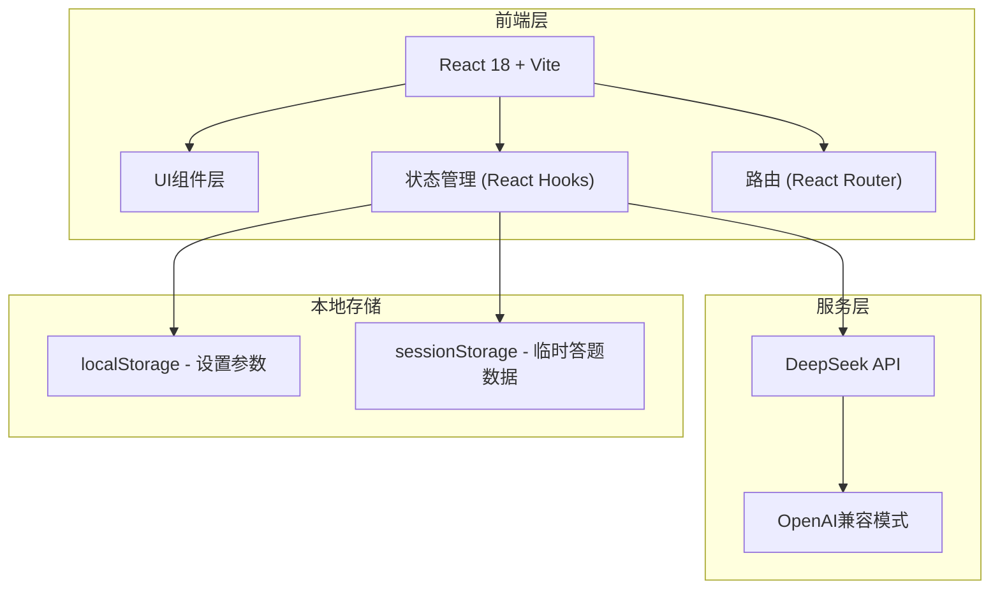

## 1. 架构设计



## 2. 技术描述

- **前端框架**：React 18 + TypeScript + Vite
- **样式方案**：TailwindCSS 3 + CSS变量主题系统
- **路由管理**：React Router DOM v6
- **状态管理**：React Hooks (useState, useContext, useReducer)
- **AI接口**：DeepSeek API (OpenAI兼容格式)
- **图标库**：Lucide React
- **动画方案**：CSS动画 + Framer Motion (可选)
- **构建工具**：Vite 5
- **包管理器**：npm

## 3. 路由定义

| 路由 | 页面名称 | 用途 |
|------|----------|------|
| `/` | 首页 | 欢迎界面、年级选择、功能入口 |
| `/practice` | 答题练习页 | 题目展示、答题、提交、结果解析 |
| `/chat` | AI对话页 | 与AI自由对话交流 |

## 4. 核心组件定义

### 4.1 组件结构

```
src/
├── components/
│   ├── layout/
│   │   ├── Header.tsx          # 顶部导航栏
│   │   └── SettingsModal.tsx   # 设置弹窗
│   ├── home/
│   │   ├── WelcomeHero.tsx     # 欢迎区
│   │   └── GradeSelector.tsx   # 年级选择器
│   ├── practice/
│   │   ├── QuestionCard.tsx    # 题目卡片
│   │   ├── AnswerInput.tsx     # 答题输入框
│   │   ├── ResultPanel.tsx     # 结果面板
│   │   └── ScoreDisplay.tsx    # 得分展示
│   └── chat/
│       ├── ChatMessage.tsx     # 聊天消息
│       └── ChatInput.tsx       # 聊天输入框
├── pages/
│   ├── HomePage.tsx            # 首页
│   ├── PracticePage.tsx        # 练习页
│   └── ChatPage.tsx            # 对话页
├── contexts/
│   ├── SettingsContext.tsx     # 设置上下文
│   └── AIApiContext.tsx        # AI API上下文
├── hooks/
│   ├── useAI.ts                # AI调用Hook
│   └── useLocalStorage.ts      # 本地存储Hook
├── utils/
│   ├── promptBuilder.ts        # 提示词构建
│   └── questionParser.ts       # 题目解析
├── types/
│   └── index.ts                # 类型定义
└── i18n/
    ├── zh.ts                   # 中文
    ├── en.ts                   # 英文
    └── ja.ts                   # 日语
```

### 4.2 类型定义

```typescript
interface Question {
  id: number;
  type: string;
  content: string;
  answer: string;
  analysis: string;
  userAnswer?: string;
  isCorrect?: boolean;
}

interface PracticeResult {
  score: number;
  total: number;
  correctCount: number;
  wrongQuestions: Question[];
  summary: string;
  encouragement: string;
}

interface Settings {
  volume: number;
  brightness: number;
  aiVoice: string;
  language: 'zh' | 'en' | 'ja';
  hiddenFeatureUnlocked: boolean;
}

interface ChatMessage {
  id: string;
  role: 'user' | 'assistant';
  content: string;
  timestamp: Date;
}
```

## 5. AI API 设计

### 5.1 DeepSeek API 调用

使用 OpenAI 兼容格式调用 DeepSeek API：

```typescript
// API 端点
const API_BASE = 'https://api.deepseek.com/v1';
const MODEL = 'deepseek-chat';

// 请求格式
interface ChatCompletionRequest {
  model: string;
  messages: { role: string; content: string }[];
  temperature?: number;
  max_tokens?: number;
}

// 响应格式
interface ChatCompletionResponse {
  choices: {
    message: {
      role: string;
      content: string;
    };
  }[];
}
```

### 5.2 核心Prompt设计

**出题Prompt：**
- 根据年级生成十道不同考察方向的数学题
- 每道题包含题目、答案、详细解析
- 返回JSON格式便于解析

**批改Prompt：**
- 对比用户答案和正确答案
- 生成每道题的对错判断
- 生成本次练习的总结和鼓励评语

**强化练习Prompt：**
- 根据错题类型生成相似题型
- 难度适当调整
- 确保考察方向与错题一致

## 6. 数据存储

### 6.1 localStorage 持久化数据

```
settings: {
  volume: 80,
  brightness: 100,
  aiVoice: 'default',
  language: 'zh',
  hiddenFeatureUnlocked: false
}
```

### 6.2 sessionStorage 临时数据

```
currentGrade: number
currentQuestions: Question[]
practiceResult: PracticeResult
chatHistory: ChatMessage[]
```

## 7. 多语言支持

支持三种语言，通过 Context 管理语言状态，所有文本从语言包中读取：
- 中文 (zh) - 默认
- 英文 (en)
- 日语 (ja)
