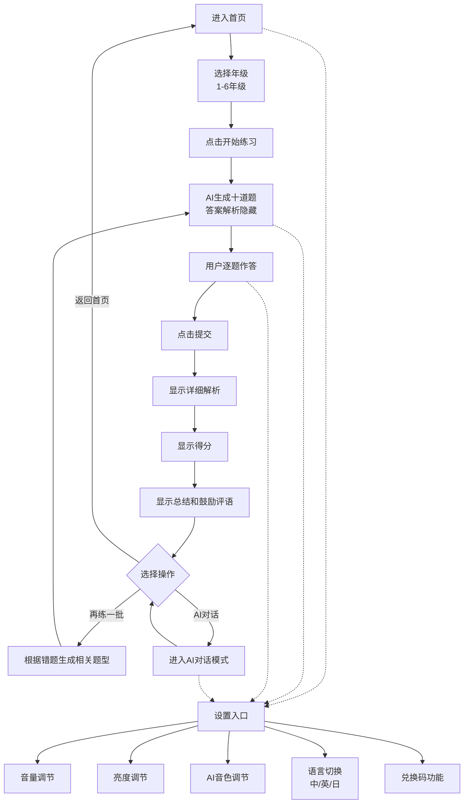

# AI智能小学数学教学网页 - 产品说明书

## 一、需求分析与场景构思

### 1. 用户画像分析

**典型用户画像：** 小学1-6年级数学成绩需要提升、渴望获得正向鼓励和陪伴感的学生。

- **画像一：需要补数学的小学生**
  - 年龄：6-12岁
  - 特征：数学基础薄弱，课堂上跟不上进度，需要额外练习巩固
  - 痛点：传统习题枯燥无味，做错了不知道为什么，缺乏耐心讲解
  - 需求：有趣的练习方式、详细的解题步骤讲解、针对性的强化训练

- **画像二：需要正向激励和陪伴的学生**
  - 年龄：6-12岁
  - 特征：性格内向或缺乏自信，需要鼓励才能坚持学习
  - 痛点：害怕做错被批评，学习动力不足，缺少学习伙伴
  - 需求：温和耐心的AI陪伴、积极的反馈鼓励、轻松无压力的学习环境

### 2. 场景故事描述

**场景故事：** 小学三年级的小明数学成绩不太好，每次做数学题都很紧张，害怕做错被家长说。他打开AI数学小助手，选择三年级，开始做十道不同类型的数学题。每做完一道题提交后，AI都会给出详细的解析和鼓励的话语，即使做错了也会耐心讲解。小明越做越有信心，做完后还和AI聊天说今天在学校的趣事，AI也鼓励他继续加油。

### 3. 功能边界确定

**产品能做什么：**

1. **系统设置**
   - 调节音量大小
   - 调节屏幕亮度
   - 调节AI角色音色
   - 兑换码功能（输入指定内容解锁隐藏功能）
   - 切换语言（支持中文、英文、日语）

2. **年级选择**
   - 支持小学1-6年级选择

3. **智能出题**
   - 点击开始后自动生成十道考察方向不同的题目
   - 题目答案和解析初始隐藏

4. **答题功能**
   - 每道题下方设有答题区供用户输入答案

5. **批改与反馈**
   - 点击提交后自动显示详细答案解析
   - 显示本次练习得分
   - 给出本次练习的总结和鼓励评语

6. **针对性强化**
   - 根据答题情况自动生成相关题型的强化练习题

7. **AI对话**
   - 支持与AI进行单独对话交流

8. **技术对接**
   - 使用DeepSeek API（OpenAI兼容模式）

**产品不能做什么：**
- 不需要用户登录注册
- 不提供社交功能
- 不保存用户历史数据（本地临时存储除外）

### 4. 交互流程设计

用户使用流程：
1. 用户进入首页，看到欢迎界面和设置入口
2. 用户选择年级（1-6年级）
3. 点击"开始练习"按钮
4. 系统生成十道不同类型的数学题，答案解析隐藏
5. 用户在每道题的答题区输入答案
6. 用户点击"提交"按钮
7. 系统显示每道题的详细解析、本次得分、总结和鼓励评语
8. 用户可选择"再练一批"（根据错题情况生成相关题型）
9. 用户可随时切换到AI对话模式进行自由交流
10. 用户可随时进入设置页面调整各项参数

---

## 二、MVP描述

### 典型用户画像
小学1-6年级需要数学补习、渴望正向鼓励和陪伴的学生。

### 场景故事
小学生在AI数学助手中选择年级做题，提交后获得详细解析和鼓励，还能和AI聊天，在轻松愉快的氛围中提升数学成绩。

### 功能列表

1. **年级选择** - 支持小学1-6年级切换
2. **智能出题** - 自动生成十道不同考察方向的数学题，答案解析初始隐藏
3. **答题区** - 每道题下方提供答题输入区域
4. **批改反馈** - 提交后显示详细答案解析、得分、总结和鼓励评语
5. **强化练习** - 根据答题情况生成相关题型的练习题
6. **AI对话** - 支持与AI单独对话交流
7. **系统设置** - 音量调节、亮度调节、AI音色调节、语言切换（中/英/日）、兑换码功能
8. **DeepSeek API对接** - 使用OpenAI兼容模式调用AI能力

### 交互流程

1. 进入首页 → 选择年级
2. 点击开始 → 生成十道题（答案隐藏）
3. 逐题作答 → 在答题区输入答案
4. 点击提交 → 显示解析、得分、鼓励评语
5. 选择再练 → 根据错题生成新题
6. 随时可进入AI对话模式
7. 随时可进入设置调整参数

---

## 三、MVP流程图

