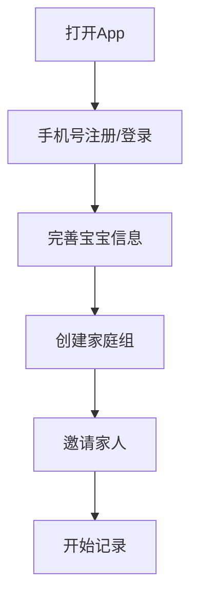
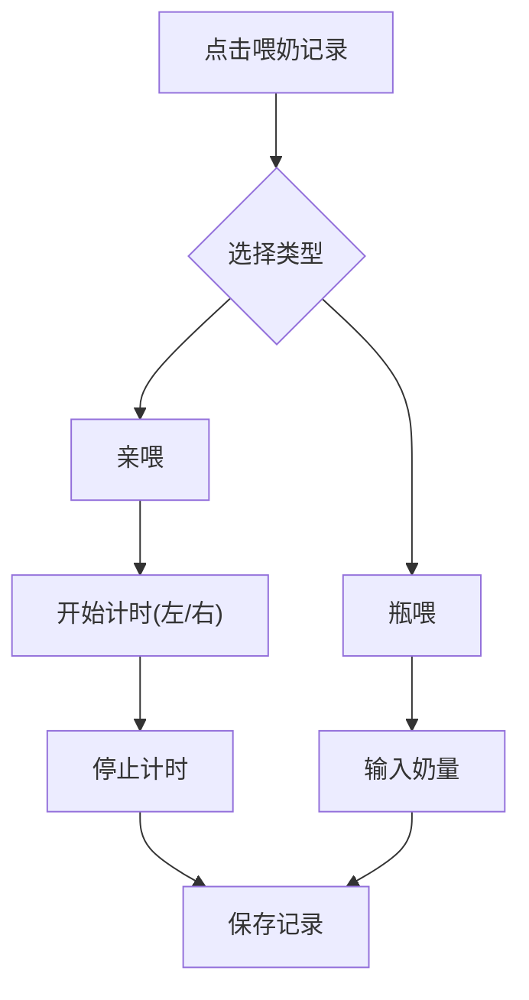
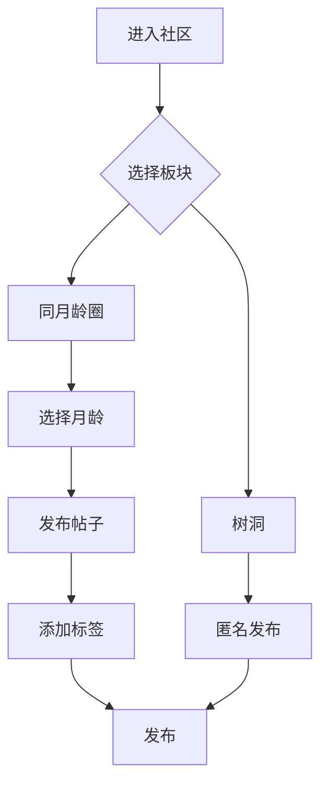

## 1. 产品概述
一款专为新手爸妈设计的全方位育儿记录与交流平台，集宝宝成长记录、社区交流、AI分析、家庭共享于一体，让育儿更轻松、更科学。

## 2. 核心功能

### 2.1 用户角色
| 角色 | 注册方式 | 核心权限 |
|------|----------|----------|
| 宝妈/宝爸 | 手机号注册 | 完整功能使用，包括记录、发帖、AI分析 |
| 家庭成员 | 邀请加入 | 查看记录，参与家庭组数据同步 |

### 2.2 功能模块
1. **首页**：宝宝状态概览、快捷记录入口、智能提醒
2. **记录中心**：喂奶、排泄、睡眠、生长、体温、用药、里程碑记录
3. **社区**：同月龄圈子、树洞板块、经验分享
4. **AI分析**：趋势图表、智能解读、健康预警
5. **家庭组**：成员管理、数据同步、交接提示
6. **儿保报告**：自动生成结构化图文摘要
7. **大便识别**：拍照分析大便颜色性状
8. **妈妈关怀**：产后情绪、恶露恢复、盆底肌训练记录
9. **提醒中心**：喂养提醒、用药提醒、疫苗接种提醒
10. **疫苗计划**：疫苗时间表、接种记录、到期提醒
11. **政务提醒**：少儿互助金等周期性提醒

### 2.3 页面详情
| 页面名称 | 模块名称 | 功能描述 |
|----------|----------|----------|
| 首页 | 概览卡片 | 显示最后喂奶时间、睡眠时长、身高体重等关键信息 |
| 首页 | 快捷记录 | 一键记录喂奶、排泄、睡眠等高频操作 |
| 首页 | 智能提醒 | 显示待办提醒事项 |
| 记录中心 | 喂奶记录 | 亲喂左右计时、瓶喂奶量记录 |
| 记录中心 | 排泄记录 | 大便性状颜色、小便次数 |
| 记录中心 | 睡眠记录 | 时长、小觉质量记录 |
| 记录中心 | 生长记录 | 身高体重头围记录 |
| 记录中心 | 其他记录 | 体温、用药、里程碑 |
| 社区 | 同月龄圈 | 按月龄分组交流，实用标签筛选 |
| 社区 | 树洞 | 完全匿名倾诉板块 |
| AI分析 | 趋势图 | 吃奶量、睡眠、生长曲线图表 |
| AI分析 | 智能解读 | WHO标准曲线对比，预警提示 |
| 家庭组 | 成员管理 | 添加/移除家庭成员 |
| 家庭组 | 数据同步 | 实时显示成员操作记录 |
| 儿保报告 | 报告生成 | 自动整理近期数据成图文摘要 |
| 大便识别 | 拍照分析 | AI辅助分析大便颜色性状 |
| 妈妈关怀 | 自我记录 | 产后情绪、恶露、饮水量、盆底肌训练 |
| 提醒中心 | 提醒管理 | 查看和管理各类提醒 |
| 疫苗计划 | 接种时间表 | 根据生日自动生成疫苗计划 |
| 疫苗计划 | 接种记录 | 记录已打疫苗信息 |
| 政务提醒 | 互助金提醒 | 每年少儿互助金缴纳提醒 |

## 3. 核心流程

### 用户注册登录流程

### 喂奶记录流程

### 社区发帖流程

## 4. 用户界面设计

### 4.1 设计风格
- **主色调**：柔和温暖的粉色(#FFB6C1)和淡蓝色(#ADD8E6)搭配米白色背景
- **辅助色**：橙色(#FFA500)用于提醒，绿色(#90EE90)用于健康状态，红色(#FF6B6B)用于预警
- **按钮风格**：圆角大按钮，渐变色彩，触摸友好
- **字体**：圆润可爱的无衬线字体，标题使用粗体
- **布局**：卡片式布局，信息分层清晰
- **图标风格**：圆润卡通风格，配合emoji增强亲和力

### 4.2 页面设计概述
| 页面名称 | 模块名称 | UI元素 |
|----------|----------|--------|
| 首页 | 顶部导航 | 宝宝头像、名称、月龄显示 |
| 首页 | 状态卡片 | 最后喂奶时间、睡眠、体重等关键指标 |
| 首页 | 快捷操作区 | 大按钮网格布局，喂奶、排泄、睡眠等 |
| 首页 | 提醒区域 | 滚动展示待办提醒 |
| 记录中心 | 分类标签 | 横向滚动切换记录类型 |
| 记录中心 | 表单区域 | 简洁表单，支持拍照上传 |
| 社区 | 板块切换 | Tab切换同月龄圈/树洞 |
| 社区 | 帖子列表 | 卡片式帖子展示，带标签 |
| AI分析 | 图表区域 | 交互式趋势图表 |
| AI分析 | 解读区域 | AI文字解读和预警提示 |
| 家庭组 | 成员列表 | 头像+角色展示 |
| 家庭组 | 活动日志 | 时间线展示成员操作 |
| 儿保报告 | 报告预览 | 结构化图文展示 |
| 大便识别 | 拍照区域 | 相机入口+图片预览 |

### 4.3 响应式设计
- **移动端优先**：针对手机屏幕优化，支持单手操作
- **大触控区域**：按钮最小48px，方便抱着宝宝时操作
- **横向滑动**：分类标签横向滚动，避免层级过深
- **语音交互**：支持语音唤醒和语音输入

### 4.4 视觉特色
- **温暖氛围**：柔和渐变背景，圆角卡片
- **动态效果**：按钮按压反馈，页面切换动画
- **数据可视化**：直观的图表和进度条
- **情感化设计**：可爱图标和温馨提示语