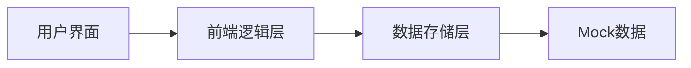

## 1. 架构设计


## 2. 技术描述
- **前端**：纯HTML5 + CSS3 + JavaScript (ES6+)
- **样式框架**：TailwindCSS 3 (CDN引入)
- **图表库**：Chart.js (CDN引入)
- **图标**：Font Awesome (CDN引入)
- **数据存储**：LocalStorage (模拟持久化)
- **后端**：无，使用Mock数据模拟

## 3. 页面结构
| 文件路径 | 页面名称 | 功能描述 |
|----------|----------|----------|
| index.html | 首页 | 宝宝状态概览、快捷记录、智能提醒 |
| pages/record.html | 记录中心 | 喂奶、排泄、睡眠、生长等记录 |
| pages/community.html | 社区 | 同月龄圈、树洞板块 |
| pages/analysis.html | AI分析 | 趋势图、智能解读 |
| pages/family.html | 家庭组 | 成员管理、数据同步 |
| pages/report.html | 儿保报告 | 自动生成报告 |
| pages/poop.html | 大便识别 | 拍照分析大便 |
| pages/mom.html | 妈妈关怀 | 产后记录 |
| pages/vaccine.html | 疫苗计划 | 接种时间表 |

## 4. 数据模型

### 4.1 宝宝信息
```json
{
  "id": "baby_001",
  "name": "小糯米",
  "birthday": "2025-07-09",
  "gender": "girl",
  "avatar": "baby.png"
}
```

### 4.2 喂奶记录
```json
{
  "id": "feed_001",
  "type": "breast",
  "side": "left",
  "duration": 15,
  "amount": null,
  "time": "2026-07-09 08:00",
  "note": ""
}
```

### 4.3 排泄记录
```json
{
  "id": "poop_001",
  "type": "poop",
  "color": "yellow",
  "consistency": "soft",
  "urine_count": 3,
  "time": "2026-07-09 10:00",
  "photo": null
}
```

### 4.4 睡眠记录
```json
{
  "id": "sleep_001",
  "start_time": "2026-07-09 14:00",
  "end_time": "2026-07-09 15:30",
  "quality": "good",
  "note": ""
}
```

### 4.5 生长记录
```json
{
  "id": "growth_001",
  "date": "2026-07-09",
  "height": 68,
  "weight": 7.5,
  "head_circumference": 44
}
```

### 4.6 社区帖子
```json
{
  "id": "post_001",
  "type": "community",
  "month_group": "6个月",
  "tags": ["亲测有效", "辅食"],
  "content": "分享一个超好用的辅食食谱...",
  "author": "匿名妈妈",
  "time": "2026-07-09 09:00",
  "likes": 128
}
```

### 4.7 家庭组
```json
{
  "id": "family_001",
  "name": "幸福小家",
  "members": [
    {"id": "user_001", "name": "妈妈", "role": "admin", "avatar": "mom.png"},
    {"id": "user_002", "name": "爸爸", "role": "member", "avatar": "dad.png"},
    {"id": "user_003", "name": "奶奶", "role": "member", "avatar": "grandma.png"}
  ],
  "activity_log": [
    {"user": "妈妈", "action": "记录喂奶", "time": "2026-07-09 08:00"}
  ]
}
```

### 4.8 疫苗计划
```json
{
  "id": "vaccine_001",
  "name": "乙肝疫苗",
  "dose": "第1针",
  "due_date": "2025-07-16",
  "status": "completed",
  "lot_number": "202506001",
  "manufacturer": "北京生物"
}
```

## 5. 核心功能实现

### 5.1 语音唤醒模拟
- 使用Web Speech API实现语音识别
- 预设命令词："记录母乳左侧15分钟"、"宝宝拉了"、"开始哄睡"

### 5.2 AI分析模拟
- 使用Chart.js生成趋势图表
- 预设AI解读文本，模拟智能分析

### 5.3 提醒系统模拟
- 使用setInterval模拟提醒触发
- 基于Mock数据计算提醒时间

### 5.4 大便识别模拟
- 拍照功能使用input type="file"
- AI分析结果使用预设规则模拟

## 6. 文件结构
```
/
├── index.html          # 首页
├── style.css           # 全局样式
├── script.js           # 全局脚本
├── pages/
│   ├── record.html     # 记录中心
│   ├── community.html  # 社区
│   ├── analysis.html   # AI分析
│   ├── family.html     # 家庭组
│   ├── report.html     # 儿保报告
│   ├── poop.html       # 大便识别
│   ├── mom.html        # 妈妈关怀
│   └── vaccine.html    # 疫苗计划
├── data/
│   └── mock.js         # Mock数据
└── assets/
    └── icons/          # 图标资源
```